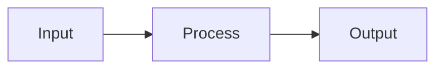

# Architecture Manager

Manages architecture documents in the AI Agent Orchestration System.

## Quick Start

When working with architecture documents:

1. **Check manifest**: Read `doc/.manifest.json` for existing architectures
2. **Create document**: Write to `doc/Architecture/`
3. **Register**: Add entry to manifest
4. **Link**: Connect to relevant action plans

## Core Operations

### Register New Architecture

When a new architecture document is created:

1. **Compute hash**:
   ```javascript
   const crypto = require('crypto');
   const content = fs.readFileSync(filePath, 'utf8');
   const hash = 'sha256:' + crypto.createHash('sha256').update(content).digest('hex');
   ```

2. **Add to manifest**:
   ```json
   {
     "artifacts": {
       "architectures": {
         "arch-id": {
           "path": "doc/Architecture/filename.md",
           "hash": "sha256:...",
           "last_modified": "2026-01-25T10:00:00Z",
           "description": "Brief description of this architecture"
         }
       }
     }
   }
   ```

3. **Update manifest timestamp**:
   ```json
   {
     "last_updated": "2026-01-25T10:00:00Z"
   }
   ```

### Link Architecture to Action Plan

When connecting an architecture to an action plan:

1. **Update action plan frontmatter**:
   ```yaml
   architecture_refs:
     - doc/Architecture/main.md
   ```

2. **Add reference section to plan body**:
   ```markdown
   ## Architecture Reference
   - [Main Architecture](../Architecture/main.md) - Status: SYNCED
   ```

3. **Update manifest action plan entry**:
   ```json
   {
     "architecture_refs": ["main-architecture"]
   }
   ```

4. **Store sync hash**:
   ```json
   {
     "last_synced_hash": "sha256:..."
   }
   ```

### Verify Architecture Integrity

To check if architectures are properly registered:

1. List all files in `doc/Architecture/`
2. Compare with manifest entries
3. Report any unregistered or missing files

```javascript
function verifyArchitectures(manifest, docPath) {
  const registered = Object.values(manifest.artifacts.architectures)
    .map(a => a.path);
  const files = fs.readdirSync(path.join(docPath, 'Architecture'))
    .filter(f => f.endsWith('.md'))
    .map(f => `doc/Architecture/${f}`);
  
  const unregistered = files.filter(f => !registered.includes(f));
  const missing = registered.filter(r => !files.includes(r));
  
  return { unregistered, missing };
}
```

## Architecture Document Guidelines

### Recommended Structure

```markdown
# Architecture: <Name>

## Overview
Brief description of what this architecture covers.

## Context
- Business context
- Technical constraints
- Key stakeholders

## System Components
### Component 1
Description and responsibilities

### Component 2
Description and responsibilities

## Data Flow


## Interfaces
- API contracts
- Event schemas
- Integration points

## Decisions
Document key architectural decisions and rationale.

## Appendix
- Glossary
- References
```

### Naming Conventions

- Use kebab-case for file names: `user-authentication.md`
- Use descriptive names: `api-gateway-design.md` not `design.md`
- Prefix with domain if applicable: `payment-service-architecture.md`

## Sync Management

### How Sync Detection Works

1. Hook monitors file edits in `doc/Architecture/`
2. When architecture changes:
   - Hash is recomputed
   - Related action plans are marked `out_of_sync`
   - Manifest is updated

### Manual Sync Check

To manually verify sync status:

```bash
node ~/.cursor/skills/project-orchestrator/scripts/check-sync-status.js
```

### Resolving Sync Issues

When an architecture changes and plans are out of sync:

1. Review the architecture changes
2. For each affected action plan:
   - Determine if plan needs updates
   - Update plan if necessary
   - Mark as synced when done

## Best Practices

1. **Version control**: Keep architectures in git
2. **Atomic changes**: One concept per document
3. **Keep updated**: Review quarterly or after major changes
4. **Cross-reference**: Link between related architectures
5. **Diagram heavy**: Use Mermaid for visual clarity

## Troubleshooting

### Architecture Not Detected

- Verify file is in `doc/Architecture/` directory
- Check file extension is `.md`
- Ensure manifest has correct path

### Sync Not Triggering

- Verify `hooks.json` is configured
- Check hook script is executable
- Review hook timeout settings
