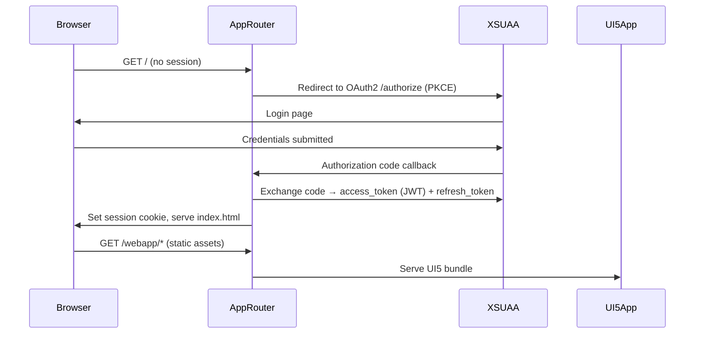
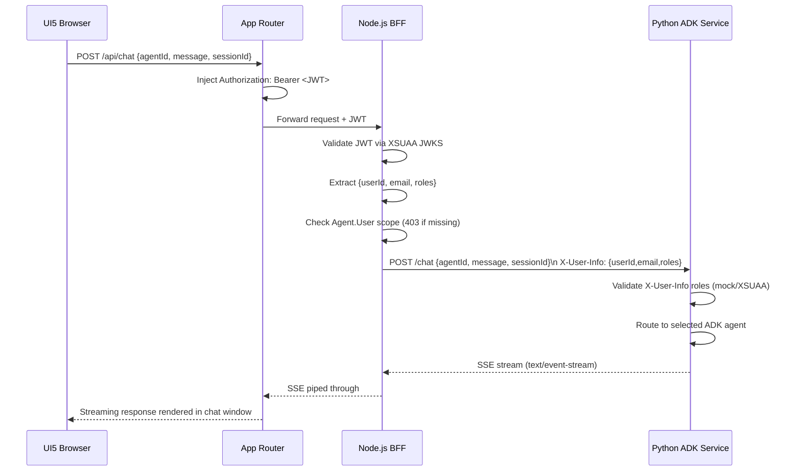
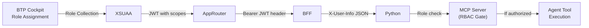

# Architecture: Fiori ADK Playground — Full-Stack AI Chat on SAP BTP

## Overview

A modern AI agent playground built on SAP BTP, delivering a ChatGPT/Claude-style chat experience via SAP Fiori UI5, backed by an existing Python + Google ADK agent service with PostgreSQL. Authentication and role-based access are handled end-to-end through SAP XSUAA, with user identity and roles propagated all the way to the Python MCP layer. The PostgreSQL write path is designed for a clean future swap to SAP HANA.

---

## Context

| Dimension | Detail |
|---|---|
| **Existing backend** | Python + Google ADK + PostgreSQL (already running) |
| **New frontend** | SAP Fiori UI5 chat app on SAP BTP Cloud Foundry |
| **Auth target** | SAP XSUAA (OAuth2 / JWT) with role scopes |
| **Future DB** | PostgreSQL write path → SAP HANA (no structural refactor needed) |
| **Target runtime** | SAP BTP Cloud Foundry |
| **Deployment model** | Multi-Target Application (MTA) |

---

## System Components

### 1. SAP Fiori UI5 App (`app/`)
The chat frontend. A single-page UI5 application rendered in the browser. Implements a modern chat window (message bubbles, streaming text, agent selector, session history) similar to ADK Web UI but with Fiori design system (SAP Horizon theme). No login screen is coded here — XSUAA + App Router handle it transparently.

**Responsibilities**
- Render chat messages (user + agent bubbles) with streaming support via SSE
- Agent selector dropdown: fetched dynamically from Node.js BFF `/api/agents`
- Session management (new session, session history)
- Attach XSUAA Bearer JWT (injected automatically by App Router) to every API call
- Display user name and active roles from decoded JWT

### 2. SAP App Router (`approuter/`)
The authentication and routing gateway. An `@sap/approuter` Node.js process that acts as the XSUAA OAuth2 client. All browser traffic enters here. The App Router:
- Redirects unauthenticated users to XSUAA login page
- Exchanges authorization codes for JWT access tokens
- Injects `Authorization: Bearer <JWT>` header into proxied API requests
- Routes `/` → UI5 static assets, `/api/*` → Node.js BFF, `/backend/*` → Python backend (optional direct path)

### 3. Node.js BFF — Backend for Frontend (`api/`)
A lightweight Express.js service that sits between the App Router and the Python backend. Acts as a trust boundary and enrichment layer.

**Responsibilities**
- Validate XSUAA JWT signature using `@sap/xssec` v4 (`createSecurityContext(authService, { req })`) + JWKS auto-fetch
- Read XSUAA credentials from `VCAP_SERVICES` via `@sap/xsenv`
- Extract user identity: `{ userId, email, fullName, scopes, roles }` from `SecurityContext`
- Enforce coarse-grained access: `secContext.checkLocalScope('Agent.User')` → 403 if false
- Proxy REST calls to Python backend with enriched `X-User-Info` header
- Handle SSE streaming: open SSE connection to Python, pipe to browser
- Expose `/api/agents` and `/api/chat` endpoints

**Key v4 API pattern (verified against `@sap/xssec@4.12.2`):**
```js
const { createSecurityContext, XsuaaService, SECURITY_CONTEXT,
        errors: { ValidationError } } = require("@sap/xssec");
const xsenv = require("@sap/xsenv");

// Read XSUAA credentials from bound service (VCAP_SERVICES)
const { xsuaa } = xsenv.getServices({ xsuaa: { tag: "xsuaa" } });
const authService = new XsuaaService(xsuaa);

async function authMiddleware(req, res, next) {
  try {
    req[SECURITY_CONTEXT] = await createSecurityContext(authService, { req });
    next();
  } catch (e) {
    res.sendStatus(e instanceof ValidationError ? 401 : 500);
  }
}

// Scope check in route handler:
app.post("/api/chat", authMiddleware, (req, res) => {
  if (!req[SECURITY_CONTEXT].checkLocalScope("Agent.User")) return res.sendStatus(403);
  const token = req[SECURITY_CONTEXT].token;
  const userInfo = { userId: token.payload.sub, email: token.payload.email,
                     roles: token.scopes };
  // forward to Python...
});
```

### 4. Python ADK Agent Service (existing, external)
The existing Python application. Runs independently (on BTP, on-prem, or any reachable host). Exposes a REST API consumed by the Node.js BFF.

**Responsibilities**
- `GET /agents` — list available agent definitions
- `POST /chat` — route message to selected agent, stream response
- Accept `X-User-Info` header and validate roles (currently mock RBAC, upgradeable to `sap-xssec` Python library)
- MCP server layer for tool calls (RBAC-gated)
- Read/write to PostgreSQL (write path isolated for future HANA swap)

### 5. SAP BTP Platform Services

| Service | Plan | Role in System |
|---|---|---|
| **XSUAA** (Authorization & Trust Management) | `application` | Issues JWTs, owns role definitions, OAuth2 AS |
| **Destination Service** | `lite` | Stores Python backend URL + credentials securely |
| **HTML5 Application Repository** | `app-host` | Hosts built UI5 static assets |
| **Cloud Foundry Runtime** | — | Runs App Router + Node.js BFF |
| **SAP Build Work Zone** (optional) | `standard` | Integrate Fiori app into a Launchpad tile |

---

## Data Flow

### Authentication Flow (First Visit)



### Chat Request Flow (Authenticated User)



### Role Propagation Flow



---

## Project File & Folder Structure

```
fiori-app/
│
├── app/                                  # SAP Fiori UI5 Application
│   ├── webapp/
│   │   ├── controller/
│   │   │   ├── App.controller.js         # Root app controller
│   │   │   ├── Chat.controller.js        # Chat logic: send, receive, stream
│   │   │   └── AgentSelector.controller.js
│   │   ├── view/
│   │   │   ├── App.view.xml              # Shell + navigation container
│   │   │   ├── Chat.view.xml             # Chat window: message list + input bar
│   │   │   └── AgentSelector.view.xml    # Agent picker fragment/dialog
│   │   ├── model/
│   │   │   ├── models.js                 # JSONModel factory, user model
│   │   │   └── formatter.js             # Date/role display formatters
│   │   ├── fragment/
│   │   │   └── UserInfo.fragment.xml     # Avatar + name + roles display
│   │   ├── css/
│   │   │   └── style.css                 # Chat bubble overrides, streaming cursor
│   │   ├── i18n/
│   │   │   └── i18n.properties           # All UI strings (no hardcoded text)
│   │   ├── Component.js                  # UI5 component bootstrap
│   │   ├── index.html                    # Entry point (loads UI5 bootstrap)
│   │   └── manifest.json                 # App descriptor: routes, models, XSUAA OAuth config
│   ├── ui5.yaml                          # UI5 Tooling config (build + serve)
│   └── package.json
│
├── approuter/                            # SAP App Router (auth gateway)
│   ├── xs-app.json                       # Route table: / → UI5, /api → BFF
│   ├── default-env.json                  # Local dev: VCAP_SERVICES mock
│   └── package.json                      # @sap/approuter dependency
│
├── api/                                  # Node.js BFF (Backend for Frontend)
│   ├── src/
│   │   ├── routes/
│   │   │   ├── agents.js                 # GET /api/agents → proxy to Python
│   │   │   └── chat.js                   # POST /api/chat → proxy + SSE pipe
│   │   ├── middleware/
│   │   │   ├── auth.js                   # @sap/xssec JWT validation
│   │   │   └── rbac.js                   # Scope enforcement (Agent.User etc.)
│   │   ├── services/
│   │   │   ├── pythonProxy.js            # HTTP client to Python backend (via Destination)
│   │   │   └── destinationService.js     # Reads Python URL from BTP Destination
│   │   ├── config/
│   │   │   └── index.js                  # Env var config (VCAP_SERVICES parser)
│   │   └── app.js                        # Express app setup
│   ├── package.json
│   └── Dockerfile                        # (optional) containerized deployment
│
├── xs-security.json                      # XSUAA app security descriptor (shared)
├── mta.yaml                              # MTA build & deploy descriptor
├── .env.example                          # Local dev env vars template
│
└── doc/
    ├── Architecture/
    │   └── fiori-adk-playground.md       # ← THIS FILE
    └── Action-Plan/
        └── (to be created)
```

---

## Interfaces & API Contracts

### Node.js BFF — Exposed Endpoints

#### `GET /api/agents`
Returns list of available agents from Python backend.

**Response**
```json
{
  "agents": [
    {
      "id": "research-agent",
      "name": "Research Agent",
      "description": "Answers questions using web search",
      "requiredRole": "Agent.User"
    }
  ]
}
```

#### `POST /api/chat`
Sends a message to the selected agent. Returns Server-Sent Events stream.

**Request**
```json
{
  "agentId": "research-agent",
  "message": "What is SAP BTP?",
  "sessionId": "uuid-v4-session-id"
}
```

**Response** — `Content-Type: text/event-stream`
```
data: {"type":"token","content":"SAP BTP "}
data: {"type":"token","content":"(Business Technology Platform) is..."}
data: {"type":"done","sessionId":"uuid-v4-session-id"}
```

**Headers sent to Python backend**
```
Authorization: Bearer <XSUAA JWT>      # original JWT (optional — for Python-side XSUAA validation)
X-User-Info: {"userId":"...","email":"...","fullName":"...","roles":["Agent.User"]}
```

### Python Backend — Expected Endpoints

#### `GET /agents`
Returns agent registry. Python already has this or it can be added.

#### `POST /chat`
```json
{
  "agentId": "research-agent",
  "message": "...",
  "sessionId": "..."
}
```
Headers: `X-User-Info` (JSON), optionally `Authorization: Bearer <JWT>`

---

## XSUAA Security Model (`xs-security.json`)

```json
{
  "xsappname": "fiori-adk-playground",
  "tenant-mode": "dedicated",
  "scopes": [
    {
      "name": "$XSAPPNAME.Agent.User",
      "description": "Basic access: can chat with agents"
    },
    {
      "name": "$XSAPPNAME.Agent.Admin",
      "description": "Admin access: manage agents, view all sessions"
    }
  ],
  "role-templates": [
    {
      "name": "AgentUser",
      "description": "Standard user role",
      "scope-references": ["$XSAPPNAME.Agent.User"]
    },
    {
      "name": "AgentAdmin",
      "description": "Administrator role",
      "scope-references": ["$XSAPPNAME.Agent.User", "$XSAPPNAME.Agent.Admin"]
    }
  ],
  "role-collections": [
    {
      "name": "ADK Playground User",
      "role-template-references": ["$XSAPPNAME.AgentUser"]
    },
    {
      "name": "ADK Playground Admin",
      "role-template-references": ["$XSAPPNAME.AgentAdmin"]
    }
  ]
}
```

---

## SAP BTP Account Setup — Step-by-Step

These are the manual steps the **account owner/developer** must perform in the SAP BTP Cockpit and CLI before or during deployment.

### Step 1 — BTP Account & Subaccount
- [ ] Have an active SAP BTP Global Account (trial or enterprise)
- [ ] Create or use existing **Subaccount** (e.g., `fiori-adk-dev`)
- [ ] Note: subaccount region determines CF API endpoint (e.g., `cf.eu10.hana.ondemand.com`)

### Step 2 — Enable Cloud Foundry Environment
- [ ] In subaccount → **Enable Cloud Foundry**
- [ ] Create a **Space** (e.g., `dev`)
- [ ] Assign yourself **Space Developer** role

### Step 3 — Enable Required BTP Services (Entitlements)

**Cockpit navigation (verified current UI):**

1. Open [BTP Cockpit](https://cockpit.btp.cloud.sap) and navigate to your **Global Account**
2. In left sidebar go to **Entitlements → Entity Assignments**
3. In the dropdowns choose **Show: Subaccounts** and select your subaccount, then click **Go**
4. Click **Configure Entitlements** (enters edit mode)
5. Click **Add Service Plans**, then search and enable each service below
6. Click **Save** when done

| Service | Plan | Required |
|---|---|---|
| Authorization and Trust Management Service | `application` | Yes |
| Destination Service | `lite` | Yes |
| HTML5 Application Repository | `app-host` | Yes |
| Cloud Foundry Runtime | standard | Yes |
| SAP Build Work Zone | `standard` (optional) | No |

> **Trial accounts**: The default `trial` subaccount usually has all trial entitlements pre-assigned. You only need to do this step if you created a fresh subaccount or if a service plan is missing.

### Step 4 — Create Service Instances (via CLI or Cockpit)

> **Prerequisite**: CF CLI must be installed and you must be logged in (`cf login`). See Step 7 first if not done yet.
> MTA deployment in Step 8 can also create these automatically from `mta.yaml` resources — this step is only needed for manual/dev setup.

```bash
# XSUAA instance — xs-security.json is passed as inline parameter
cf create-service xsuaa application fiori-adk-xsuaa -c xs-security.json

# Destination service instance (no config file needed)
cf create-service destination lite fiori-adk-destination

# HTML5 App Repository host (no config file needed)
cf create-service html5-apps-repo app-host fiori-adk-html5-host
```

**Verify instances are created:**
```bash
cf services
# Should show all 3 services with status "create succeeded"
```

> **Note**: `cf create-service <service> <plan> <instance-name> -c <file>` is the current syntax. The `-c` flag accepts a JSON file path or an inline JSON string.

### Step 5 — Configure Destination for Python Backend

**Cockpit navigation:** Subaccount → **Connectivity → Destinations** → **New Destination**

| Field | Value |
|---|---|
| Name | `PYTHON_ADK_BACKEND` |
| Type | `HTTP` |
| URL | `https://your-python-backend-url` |
| Proxy Type | `Internet` |
| Authentication | `NoAuthentication` |

**Add these Additional Properties** (click "New Property" for each):

| Property | Value |
|---|---|
| `HTML5.DynamicDestination` | `true` |
| `WebIDEEnabled` | `false` |

> **Important `forwardAuthToken` caveat**: SAP's `forwardAuthToken=true` property in Destinations can fail with a `ServiceInstanceName` required error when used with `NoAuthentication`. Instead, the **Node.js BFF** in this architecture reads the destination URL via `@sap/xsenv` and manually adds the `Authorization: Bearer <JWT>` and `X-User-Info` headers when calling the Python backend. This is more reliable and gives full control. Do **not** set `forwardAuthToken` in the destination config — the BFF handles token forwarding in code.

### Step 6 — Assign Role Collections to Users
In BTP Cockpit → Subaccount → **Security → Role Collections**:
- [ ] Assign **ADK Playground User** role collection to developer/test users
- [ ] Assign **ADK Playground Admin** role collection to admin users

### Step 7 — CF CLI Setup & Login

1. **Download CF CLI v8+** from [cloudfoundry.github.io/cli](https://github.com/cloudfoundry/cli/releases)
2. Find your **API endpoint** in BTP Cockpit → Subaccount → Overview → Cloud Foundry Environment section

```bash
cf api https://api.cf.eu10.hana.ondemand.com   # replace eu10 with your region
cf login                                        # prompts for email + password + org + space
# OR: cf login -u <email> --sso  (if using SSO/IDP)

cf target -o <your-org> -s <your-space>         # confirm target
cf target                                       # verify
```

> **Find your region**: In BTP Cockpit → Subaccount → Overview, you'll see "API Endpoint" under Cloud Foundry Environment. Common regions: `eu10`, `us10`, `ap10`.

### Step 8 — Install MTA Build Tool & CF Multiapps Plugin

```bash
# Install MTA Build Tool globally
npm install -g mbt
mbt --version   # verify

# Install CF Multiapps plugin (required for cf deploy with .mtar)
# Windows (PowerShell):
cf install-plugin -f https://github.com/cloudfoundry-incubator/multiapps-cli-plugin/releases/latest/download/multiapps-plugin.win64.exe

# macOS:
# cf install-plugin -f https://github.com/cloudfoundry-incubator/multiapps-cli-plugin/releases/latest/download/multiapps-plugin.osx

# Linux 64-bit:
# cf install-plugin -f https://github.com/cloudfoundry-incubator/multiapps-cli-plugin/releases/latest/download/multiapps-plugin.linux64

# Verify plugin is installed:
cf plugins | grep multiapps
# Should show: multiapps  <version>  bg-deploy, deploy, mta, mta-ops, mtas, purge-mta-results, undeploy
```

### Step 9 — Build and Deploy

```bash
# From the repo root (where mta.yaml lives):
mbt build
# Produces: mta_archives/fiori-adk-playground_<version>.mtar

# Deploy to Cloud Foundry:
cf deploy mta_archives/fiori-adk-playground_*.mtar

# Monitor deployment logs in real time:
cf deploy mta_archives/fiori-adk-playground_*.mtar --retries 1

# If deploy fails, check logs:
cf mta fiori-adk-playground     # shows MTA state
cf logs <app-name> --recent      # shows app startup logs
```

---

## Key Architectural Decisions

### ADR-0: XSUAA vs SAP Cloud Identity Services (IAS)
**Decision**: Use XSUAA for this project.
**Rationale**: As of 2025, SAP officially recommends **SAP Cloud Identity Services (IAS) with Authorization Policies** for *new* BTP applications, as major new features will only be added to IAS going forward. However, XSUAA is **fully supported**, simpler to set up for BTP CF apps, and has a well-known migration path to IAS when needed. Given the project's scope (internal tool, known team, BTP CF deployment), XSUAA is the right pragmatic choice now. The `@sap/xssec` v4 library supports both XSUAA and IAS with the same API surface, so migration later is straightforward.

### ADR-1: Node.js BFF vs Direct Python Access
**Decision**: Use Node.js BFF between App Router and Python backend.
**Rationale**: `@sap/xssec` v4 (Node.js) has the most mature XSUAA JWT validation library with `XsuaaService` + `createSecurityContext` API. The BFF also allows clean SSE streaming handling, request enrichment, and protects the Python service from direct public exposure. Python XSUAA lib (`sap-xssec`) can still be used on the Python side as an upgrade path.

### ADR-2: SSE over WebSocket for Streaming
**Decision**: Use Server-Sent Events (SSE) for token streaming.
**Rationale**: SSE is simpler to proxy through App Router (standard HTTP), works on CF without WebSocket upgrade negotiation, and is already used by ADK web. WebSocket can be added later for bidirectional use cases.

### ADR-3: `X-User-Info` Header for Role Propagation
**Decision**: BFF extracts user info from validated JWT and passes as `X-User-Info` JSON header to Python.
**Rationale**: Decouples Python from XSUAA JWT validation complexity. Python trusts the BFF (internal network). Future upgrade: pass the raw JWT and let Python validate independently using the SAP Python XSUAA library.

### ADR-4: PostgreSQL Write Path Isolation
**Decision**: Python code isolates all write operations behind a `db.write(...)` abstraction layer / repository pattern.
**Rationale**: When switching to HANA, only the repository implementation changes. The ADK agent logic, MCP tools, and API surface remain untouched.

### ADR-5: MTA for Deployment
**Decision**: Use Multi-Target Application (MTA) descriptor to deploy all components atomically.
**Rationale**: MTA handles service binding, environment variable injection, build order, and CF app push in a single `cf deploy` command. This is the SAP-recommended approach for multi-component BTP apps.

---

## Future State — SAP HANA Integration

When ready to swap PostgreSQL:

1. **Add HANA Cloud service instance** to `mta.yaml` resources
2. **Create HANA repository class** in Python: `HanaRepository(BaseRepository)`
3. **Swap** `PostgresRepository` → `HanaRepository` via environment variable or config flag
4. **No changes needed** to: ADK agents, MCP tools, API routes, Fiori UI, Node.js BFF, XSUAA model

This is a single-file swap thanks to ADR-4.

---

## Local Development Setup

```
Browser
  └─► localhost:5001 (approuter, default-env.json mocks XSUAA)
        ├─► localhost:3000 (UI5 Tooling serve: `ui5 serve`)
        └─► localhost:4000 (Node.js BFF: `npm run dev`)
              └─► http://localhost:8000 (Python ADK service)
```

`.env.example` will contain all required local env vars.
`default-env.json` in the approuter will mock `VCAP_SERVICES` for XSUAA and Destination.

---

## Appendix

### Technology Versions (Verified March 2026)

| Technology | Version | Verified Source |
|---|---|---|
| @sap/approuter | ^21.x | npm registry (v21.0.0 latest) |
| @sap/xssec | ^4.x | npm registry (v4.12.2 latest) |
| UI5 (SAPUI5) | 1.120.x (LTS) | SAP UI5 release notes |
| Node.js | 20 LTS | Minimum is 18; 20 LTS recommended |
| Python | 3.11+ | — |
| Cloud Foundry CLI | v8+ | — |
| MTA Build Tool (`mbt`) | ^1.2.x | — |
| CF Multiapps Plugin | latest | github.com/cloudfoundry-incubator/multiapps-cli-plugin |

### Glossary

| Term | Meaning |
|---|---|
| XSUAA | SAP's OAuth2 Authorization Server (based on Cloud Foundry UAA) |
| JWT | JSON Web Token — signed bearer token carrying user identity + scopes |
| MTA | Multi-Target Application — SAP's multi-module deployment unit |
| BFF | Backend for Frontend — dedicated API layer per frontend client |
| App Router | SAP's OAuth2-aware reverse proxy (`@sap/approuter`) |
| ADK | Google Agent Development Kit — Python framework for AI agents |
| MCP | Model Context Protocol — tool-calling standard used by the Python agents |
| SSE | Server-Sent Events — HTTP streaming for token-by-token AI responses |
| HANA | SAP HANA Cloud — in-memory columnar database |
| CF | Cloud Foundry — the PaaS runtime on SAP BTP |

### References
- [SAP BTP Documentation](https://help.sap.com/docs/btp)
- [SAP App Router on npm](https://www.npmjs.com/package/@sap/approuter) — v21.0.0 current
- [@sap/xssec v4 README](https://unpkg.com/@sap/xssec@4.12.2/README.md) — v4.12.2 current
- [CF Multiapps Plugin (GitHub)](https://github.com/cloudfoundry-incubator/multiapps-cli-plugin) — Windows/Linux/macOS binaries
- [UI5 Tooling](https://sap.github.io/ui5-tooling/)
- [MTA Build Tool](https://github.com/SAP/cloud-mta-build-tool)
- [Google ADK Documentation](https://google.github.io/adk-docs/)
