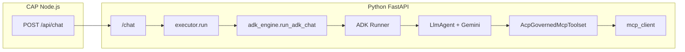
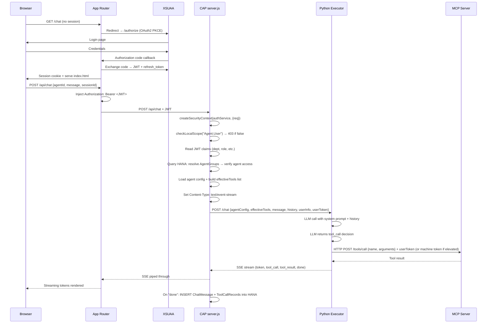

# Architecture: Agent Control Plane (SAP BTP)

> **Audience:** developers implementing this system. For product requirements and "why" reasoning, see `doc/PRD/agent-control-plane.md`.
> Last updated: 2026-04-08.

---

## 1. Overview

Agent Control Plane is a governance and chat product running on SAP BTP Cloud Foundry. It consists of two SAPUI5 frontend apps (`app/admin/` for Fiori Elements governance screens, `app/chat/` for freestyle streaming chat), an `@sap/approuter` OAuth2 gateway, a CAP Node.js service (`srv/`) that exposes OData V4 endpoints for all governed entities plus custom SSE routes in `server.js`, and a separate FastAPI Python service (`python/`) that runs LLM inference and MCP tool calls. SAP HANA Cloud (HDI container) is the sole datastore. **On Cloud Foundry**, authentication is **XSUAA** (JWT, role collections, scopes). **Local Spectrum 1 hybrid** uses **CAP dummy auth** against the **same** live HANA data (no XSUAA/IAS on the laptop); see §9 and **ADR-7**. All components deploy as a single MTA on Cloud Foundry.

---

## 2. System Components

### 1. Admin UI (`app/admin/`)
**Technology:** Fiori Elements (SAPUI5), UI5 Tooling

**Responsibilities:**
1. List Report + Object Page for `McpServer` — register, test connection, sync tools, disable.
2. List Report + Object Page for `Tool` — review Draft tools, set risk level and elevated flag, activate, run test.
3. List Report + Object Page for `Agent` — create agents, assign tools, set system prompt, model profile, identity mode.
4. List Report + Object Page for `AgentGroup` — map JWT claim keys/values to agent bundles.
5. All pages driven by OData V4 annotations in `app/admin/annotations/annotations.cds`; no custom controller logic for CRUD.

### 2. Chat UI (`app/chat/`)
**Technology:** Freestyle SAPUI5 (no Fiori Elements)

**Responsibilities:**
1. Fetch agent list from `GET /api/agents` and render agent selector dropdown (only agents the user's groups permit).
2. Display three-panel layout: session list (left), message thread (center), input bar (bottom).
3. Open SSE connection to `POST /api/chat`; render tokens incrementally as they arrive.
4. Render collapsible tool trace (`ToolTrace.fragment.xml`) below each assistant message.
5. Load session history via `GET /odata/v4/chat/ChatSessions` and `GET /odata/v4/chat/ChatMessages`.

### 3. App Router (`approuter/`)
**Technology:** `@sap/approuter` ^21.x

**Responsibilities:**
1. Act as XSUAA OAuth2 client: redirect unauthenticated requests to XSUAA login, exchange code for JWT, store session cookie.
2. Inject `Authorization: Bearer <JWT>` into every proxied request.
3. Route `/admin*` → CAP OData + Admin UI static assets.
4. Route `/chat*` → CAP OData + Chat UI static assets.
5. Route `/api/*` → CAP `server.js` custom routes.
6. Enforce that all routes require authentication via `xs-app.json` `authenticationType: "xsuaa"`.

### 4. CAP Service (`srv/`)
**Technology:** SAP CAP (Node.js), CDS, `@sap/xssec` v4

**Responsibilities:**
1. Serve `GovernanceService` OData V4 at `/odata/v4/governance` for `McpServer`, `Tool`, `Agent`, `AgentGroup` and their compositions.
2. Serve `ChatService` OData V4 at `/odata/v4/chat` for `ChatSession`, `ChatMessage`, `ToolCallRecord`.
3. Implement bound actions: `testConnection`, `syncTools` on `McpServer`; `runTest` on `Tool`.
4. `server.js` custom route `GET /api/agents`: resolve agent list from JWT claims → group lookup in HANA.
5. `server.js` custom route `POST /api/chat`: validate JWT, build effective tool list, proxy to Python as SSE, persist `ChatMessage` and `ToolCallRecord` on completion.
6. Enforce all role restrictions declared in CDS `@requires` and `@restrict` annotations.

### 5. Python Executor (`python/`)
**Technology:** FastAPI, uvicorn, httpx, **Google Agent Development Kit (ADK)** for the Gemini stack, Anthropic/OpenAI SDKs for other providers, MCP client

**LLM routing:**
- **`LLM_PROVIDER=google-genai` (default):** Gemini runs **inside ADK** — `google.adk.runners.Runner` + `LlmAgent` + `Gemini` model. Tool declarations are built from CAP’s `effectiveTools`; execution still goes through the existing `mcp_client` HTTP transport (`AcpGovernedMcpToolset` / `_AcpMcpBridgeTool` in `app/adk_engine.py`). Streaming uses ADK `RunConfig(streaming_mode=SSE)` and is mapped to the same SSE event shapes the chat UI already expects (`token`, `tool_call`, `tool_result`).
- **`LLM_PROVIDER=anthropic` / `openai`:** Unchanged hand-rolled loops in `executor.py` (no ADK).

**Why ADK as the “engine” for Gemini:** ADK is the supported framework for agents on Gemini — runners, session/event model, SSE streaming, tool orchestration, and hooks for **memory**, **artifacts**, **code execution**, **RAG / Vertex**, **MCP toolsets**, multi-agent flows, and deployment paths (e.g. Agent Engine). We keep CAP as the **source of truth for governance** (which tools exist, URLs, elevation, prompts) and inject that into ADK session state per request.

**Request-scoped ADK sessions (current):** Each `POST /chat` creates an in-memory ADK session, replays CAP `history` into ADK `Event`s, then appends the new user turn. Canonical chat persistence remains **HANA** via CAP after the stream completes. A logical next step for scale is swapping `InMemorySessionService` for an external persistent store (e.g. a managed session backend) keyed by `ChatSession` ID so ADK state survives across requests and workers.



**Responsibilities:**
1. Accept `POST /chat` from CAP `server.js`; run LLM inference (ADK for Gemini); stream SSE back.
2. Accept `POST /tool-test` from CAP `runTest` action; invoke a single MCP tool and return result.
3. Use the `effectiveTools` list provided by CAP — never decide its own tool list.
4. Call MCP servers via HTTP streamable transport; use `userToken` for delegated tools, machine service token for elevated tools (flag communicated by CAP per tool).
5. Emit structured SSE events: `token`, `tool_call`, `tool_result`, `done`, `error`.

### 6. SAP HANA Cloud
**Technology:** HDI container, managed by CAP CDS deploy

**Responsibilities:**
1. Store all governed entities: `McpServer`, `Tool`, `Agent`, `AgentTool`, `AgentGroup`, `AgentGroupClaimValue`, `AgentGroupAgent`.
2. Store all chat history: `ChatSession`, `ChatMessage`, `ToolCallRecord`.
3. Schema migrations managed by `cds deploy --to hana` via HDI.
4. Seed data in `db/data/*.csv` loaded on deploy.

---

## 3. CDS Data Model

File: `db/schema.cds`

```cds
namespace acp;
using { cuid, managed } from '@sap/cds/common';

// ─── MCP Server ──────────────────────────────────────────────────────────────

entity McpServer {
  key ID              : UUID;
  name                : String(100);
  description         : String(500);
  destinationName     : String(200);   // BTP Destination name (preferred)
  baseUrl             : String(500);   // dev-only fallback
  authType            : String enum { None; Destination; CredentialStore };
  transportType       : String enum { HTTP; stdio };
  environment         : String enum { dev; prod };
  ownerTeam           : String(100);
  status              : String(20) enum { Active; Disabled } default 'Active';
  health              : String(20) enum { OK; FAIL; UNKNOWN } default 'UNKNOWN';
  lastHealthCheck     : Timestamp;
  tools               : Composition of many Tool on tools.server = $self;
}

// ─── Tool ─────────────────────────────────────────────────────────────────────

entity Tool {
  key ID              : UUID;
  name                : String(200);   // must match MCP server tool name exactly
  description         : LargeString;  // sent to LLM as-is
  server              : Association to McpServer;
  inputSchema         : LargeString;  // JSON Schema of arguments
  outputSchema        : LargeString;  // optional
  riskLevel           : String(20) enum { Low; Medium; High } default 'Low';
  elevated            : Boolean default false;
  status              : String(20) enum { Draft; Active; Disabled } default 'Draft';
  modifiedAt          : Timestamp;
}

// ─── Agent ────────────────────────────────────────────────────────────────────

entity Agent {
  key ID              : UUID;
  name                : String(100);
  description         : String(500);
  systemPrompt        : LargeString;
  modelProfile        : String(20) enum { Fast; Quality } default 'Fast';
  identityMode        : String(20) enum { Delegated; Mixed } default 'Delegated';
  status              : String(20) enum { Draft; Active; Archived } default 'Draft';
  createdBy           : String(200);
  tools               : Composition of many AgentTool on tools.agent = $self;
}

// ─── AgentTool (join: Agent ↔ Tool) ──────────────────────────────────────────

entity AgentTool {
  key ID                : UUID;
  agent                 : Association to Agent;
  tool                  : Association to Tool;
  permissionOverride    : String(30) enum { Inherit; ForceDelegated; ForceElevated } default 'Inherit';
}

// ─── AgentGroup ───────────────────────────────────────────────────────────────

entity AgentGroup {
  key ID              : UUID;
  name                : String(100);
  description         : String(500);
  claimKey            : String(100);   // JWT attribute name e.g. "dept"
  status              : String(20) enum { Active; Disabled } default 'Active';
  claimValues         : Composition of many AgentGroupClaimValue on claimValues.group = $self;
  agents              : Composition of many AgentGroupAgent on agents.group = $self;
}

// ─── AgentGroupClaimValue (one row per matching value) ───────────────────────

entity AgentGroupClaimValue {
  key ID              : UUID;
  group               : Association to AgentGroup;
  value               : String(200);   // e.g. "procurement"
}

// ─── AgentGroupAgent (join: AgentGroup ↔ Agent) ──────────────────────────────

entity AgentGroupAgent {
  key ID              : UUID;
  group               : Association to AgentGroup;
  agent               : Association to Agent;
}

// ─── ChatSession ──────────────────────────────────────────────────────────────

entity ChatSession {
  key ID              : UUID;
  agentId             : UUID;
  userId              : String(200);
  title               : String(200);
  createdAt           : Timestamp;
  updatedAt           : Timestamp;
  messages            : Composition of many ChatMessage on messages.session = $self;
}

// ─── ChatMessage ──────────────────────────────────────────────────────────────

entity ChatMessage {
  key ID              : UUID;
  session             : Association to ChatSession;
  role                : String(20) enum { user; assistant };
  content             : LargeString;
  timestamp           : Timestamp;
  toolCalls           : Composition of many ToolCallRecord on toolCalls.message = $self;
}

// ─── ToolCallRecord ───────────────────────────────────────────────────────────

entity ToolCallRecord {
  key ID              : UUID;
  message             : Association to ChatMessage;
  toolName            : String(200);
  arguments           : LargeString;   // JSON
  resultSummary       : LargeString;
  durationMs          : Integer;
  elevatedUsed        : Boolean default false;
  timestamp           : Timestamp;
}
```

---

## 4. CAP Service Definitions

### GovernanceService (`srv/governance-service.cds`)

```cds
using acp from '../db/schema';

service GovernanceService @(path: '/odata/v4/governance') {

  // ── McpServer ────────────────────────────────────────────────────────────
  @(restrict: [
    { grant: ['READ'],              to: ['Agent.Author', 'Agent.Admin', 'Agent.Audit'] },
    { grant: ['WRITE', 'CREATE', 'UPDATE', 'DELETE'], to: ['Agent.Admin'] }
  ])
  entity McpServers as projection on acp.McpServer actions {
    action testConnection()                     returns String;  // pings server, updates health + lastHealthCheck
    action syncTools()                          returns String;  // discovers tools, creates Draft Tool records
  };

  // ── Tool ─────────────────────────────────────────────────────────────────
  @(restrict: [
    { grant: ['READ'],              to: ['Agent.Author', 'Agent.Admin', 'Agent.Audit'] },
    { grant: ['WRITE', 'CREATE', 'UPDATE', 'DELETE'], to: ['Agent.Admin'] }
  ])
  entity Tools as projection on acp.Tool actions {
    @(requires: 'Agent.Admin')
    action runTest(args: LargeString)           returns LargeString;  // calls Python /tool-test
  };

  // ── Agent ─────────────────────────────────────────────────────────────────
  @(restrict: [
    { grant: ['READ'],              to: ['Agent.Author', 'Agent.Admin', 'Agent.Audit'] },
    { grant: ['WRITE', 'CREATE', 'UPDATE', 'DELETE'], to: ['Agent.Author', 'Agent.Admin'] }
  ])
  entity Agents as projection on acp.Agent;

  entity AgentTools as projection on acp.AgentTool;

  // ── AgentGroup ───────────────────────────────────────────────────────────
  @(restrict: [
    { grant: ['READ'],              to: ['Agent.Admin', 'Agent.Audit'] },
    { grant: ['WRITE', 'CREATE', 'UPDATE', 'DELETE'], to: ['Agent.Admin'] }
  ])
  entity AgentGroups as projection on acp.AgentGroup;

  entity AgentGroupClaimValues as projection on acp.AgentGroupClaimValue;
  entity AgentGroupAgents       as projection on acp.AgentGroupAgent;
}
```

**Handler responsibilities (`srv/governance-service.js`):**
- `testConnection`: resolves the server's base URL (via `@sap-cloud-sdk/connectivity` `getDestination()` if `destinationName` is set, else uses `baseUrl`); calls `GET <resolvedBaseUrl>/health`; treats HTTP 200 as `OK`, any error as `FAIL`; writes result to `health` and `lastHealthCheck`.
- `syncTools`: calls `POST <resolvedBaseUrl>/mcp/tools/list` on the MCP server; upserts `Tool` records with `status = 'Draft'`. Duplicate tool names for the same server are updated, not inserted.
- `runTest`: requires `Agent.Admin` scope; calls `POST <python_url>/tool-test` with the tool's MCP server URL, name, and caller-supplied `args`; returns raw result string.
- Elevated flag write guard: a `before UPDATE Tools` handler rejects changes to the `elevated` field unless the requester holds `Agent.Admin`.

---

### ChatService (`srv/chat-service.cds`)

```cds
using acp from '../db/schema';

service ChatService @(path: '/odata/v4/chat') {

  // Agent.User sees only their own sessions; Agent.Audit sees all.
  @(restrict: [
    { grant: ['READ'],   to: ['Agent.User'],  where: 'userId = $user' },
    { grant: ['READ'],   to: ['Agent.Audit'] },
    { grant: ['CREATE'], to: ['Agent.User'] },
    { grant: ['UPDATE'], to: ['Agent.User'],  where: 'userId = $user' }
  ])
  entity ChatSessions as projection on acp.ChatSession;

  @(restrict: [
    { grant: ['READ'],   to: ['Agent.User', 'Agent.Audit'] },
    { grant: ['CREATE'], to: ['Agent.User'] }
  ])
  entity ChatMessages as projection on acp.ChatMessage;

  // ToolCallRecord rows are created by server.js only; no direct client writes.
  @(restrict: [
    { grant: ['READ'],   to: ['Agent.User', 'Agent.Audit'] }
  ])
  entity ToolCallRecords as projection on acp.ToolCallRecord;
}
```

**Handler notes (`srv/chat-service.js`):**
- `ChatSession` reads are automatically filtered to `userId = req.user.id` for `Agent.User` via the `@restrict` `where` clause.
- `ChatMessage` creates from the client create a message row; the server also creates rows programmatically from `server.js` on SSE completion.
- `ToolCallRecord` has no `CREATE` grant for any client scope — only `server.js` inserts these rows via `cds.run(INSERT.into(...))`.

---

### server.js custom routes (`srv/server.js`)

Runs in the same CAP Node process. Registered via `cds.on('bootstrap', app => { ... })`.

**`GET /api/agents`**

1. Validate JWT via `@sap/xssec` `createSecurityContext`.
2. Require `Agent.User` scope; return 403 otherwise.
3. Read JWT claims from `SecurityContext` (e.g. `token.payload.dept`).
4. Query HANA:
   ```sql
   SELECT DISTINCT a.ID, a.name, a.description, a.modelProfile
   FROM acp_AgentGroupAgent aga
   JOIN acp_AgentGroup g ON aga.group_ID = g.ID
   JOIN acp_AgentGroupClaimValue v ON v.group_ID = g.ID
   JOIN acp_Agent a ON aga.agent_ID = a.ID
   WHERE v.value = <claim_value>
     AND g.claimKey = <claim_key>
     AND g.status = 'Active'
     AND a.status = 'Active'
   ```
5. Return JSON array (see Section 5).

**`POST /api/chat`**

1. Validate JWT; require `Agent.User`; return 403 otherwise.
2. Parse body: `{ agentId, message, sessionId }`.
3. Verify user's groups include this agent (same query as above); return 403 if not.
4. Load agent config from HANA: `Agent` row + `AgentTool` rows with joined `Tool` rows (status `Active` only).
5. Apply `permissionOverride` logic per `AgentTool`:
   - `Inherit` → use tool's own `elevated` flag and agent's `identityMode`.
   - `ForceDelegated` → always delegated regardless of `elevated`.
   - `ForceElevated` → only allowed if agent `identityMode = 'Mixed'` AND tool `elevated = true`; otherwise reject.
6. Load conversation history: if `sessionId` is not null, query all `ChatMessage` rows for that session ordered by `timestamp ASC`; map to `{ role, content }` array. Pass as `history` in the Python payload. If `sessionId` is null, `history = []`.
7. Extract `userToken` from `req.headers.authorization`; extract `userId` and `email` from `SecurityContext` for `userInfo`.
8. Set `Content-Type: text/event-stream`; POST to Python `/chat` with full payload: `{ agentConfig, effectiveTools, message, history, userInfo, userToken }`.
9. Pipe Python SSE stream to browser.
10. On `done` event from Python: write `ChatMessage` (user role, original message) + `ChatMessage` (assistant role, accumulated tokens) + all `ToolCallRecord` rows to HANA. Update `ChatSession.updatedAt`. If `sessionId` was null, create new `ChatSession` (title = first 40 chars of user message) and return its ID in the forwarded `done` event.

---

## 5. API Contracts

### OData V4 endpoints (auto-generated by CAP)

| Method | URL | Notes |
|--------|-----|-------|
| `GET` | `/odata/v4/governance/McpServers` | List all; requires Author/Admin/Audit |
| `POST` | `/odata/v4/governance/McpServers` | Create; requires Admin |
| `PATCH` | `/odata/v4/governance/McpServers(ID)` | Update; requires Admin |
| `DELETE` | `/odata/v4/governance/McpServers(ID)` | Delete; requires Admin |
| `POST` | `/odata/v4/governance/McpServers(ID)/acp.testConnection` | Ping + update health |
| `POST` | `/odata/v4/governance/McpServers(ID)/acp.syncTools` | Discover + create Draft tools |
| `GET` | `/odata/v4/governance/Tools` | List all; requires Author/Admin/Audit |
| `POST` | `/odata/v4/governance/Tools(ID)/acp.runTest` | Admin only; invoke tool via Python |
| `GET` | `/odata/v4/governance/Agents` | List all; requires Author/Admin/Audit |
| `POST` | `/odata/v4/governance/Agents` | Create; requires Author/Admin |
| `GET` | `/odata/v4/governance/AgentGroups` | List all; requires Admin/Audit |
| `POST` | `/odata/v4/governance/AgentGroups` | Create; requires Admin |
| `GET` | `/odata/v4/chat/ChatSessions` | Filtered to own sessions for User; all for Audit |
| `GET` | `/odata/v4/chat/ChatMessages` | Filtered via association to session |

---

### REST/SSE endpoints (`server.js`)

#### `GET /api/agents`

**Response:**
```json
{
  "agents": [
    {
      "id": "3fa85f64-5717-4562-b3fc-2c963f66afa6",
      "name": "Invoice Analyst",
      "description": "Answers questions about open invoices and POs.",
      "modelProfile": "Fast"
    }
  ]
}
```

---

#### `POST /api/chat`

**Request body:**
```json
{
  "agentId": "3fa85f64-5717-4562-b3fc-2c963f66afa6",
  "message": "What are my open invoices?",
  "sessionId": "uuid-or-null"
}
```

**Response:** `Content-Type: text/event-stream`
```
data: {"type":"token","content":"Here are "}
data: {"type":"token","content":"your open invoices:"}
data: {"type":"tool_call","toolName":"query_invoices","args":{"status":"open"}}
data: {"type":"tool_result","toolName":"query_invoices","summary":"Found 3 invoices","durationMs":342}
data: {"type":"token","content":"I found 3 open invoices..."}
data: {"type":"done","sessionId":"uuid","messageId":"uuid"}
```

**Error event:**
```
data: {"type":"error","message":"Agent not accessible for this user"}
```

---

### Python service endpoints (internal — called by CAP `server.js` only)

#### `POST /chat`

**Request:**
```json
{
  "agentConfig": {
    "systemPrompt": "You are an invoice analyst. Answer only questions about invoices and POs.",
    "modelProfile": "Fast",
    "identityMode": "Delegated"
  },
  "effectiveTools": [
    {
      "name": "query_invoices",
      "description": "Queries open invoices from S/4HANA. Returns a list of invoice objects.",
      "inputSchema": { "type": "object", "properties": { "status": { "type": "string" } } },
      "mcpServerUrl": "https://mcp-server.cfapps.eu10.hana.ondemand.com",
      "elevated": false
    }
  ],
  "message": "What are my open invoices?",
  "history": [
    { "role": "user", "content": "Hello" },
    { "role": "assistant", "content": "Hi! How can I help you?" }
  ],
  "userInfo": {
    "userId": "john.doe@example.com",
    "email": "john.doe@example.com",
    "groups": ["Procurement Group"]
  },
  "userToken": "Bearer eyJhbGciOiJSUzI1NiJ9..."
}
```

**Response:** SSE stream (same format as `POST /api/chat` above).

---

#### `POST /tool-test`

Admin-only. Called by CAP `runTest` action.

**Request:**
```json
{
  "mcpServerUrl": "https://mcp-server.cfapps.eu10.hana.ondemand.com",
  "toolName": "query_invoices",
  "args": { "status": "open" }
}
```

**Response:**
```json
{
  "result": "[{\"id\":\"INV-001\",\"amount\":1234.50,\"status\":\"open\"}]"
}
```

---

## 6. Auth Flow

### Mermaid Sequence Diagram



### Agent Group Resolution (plain text)

1. CAP reads the validated `SecurityContext` from the request.
2. Extracts all JWT claim key/value pairs from `token.payload` (e.g. `dept: "procurement"`, `costCenter: "SCM"`).
3. For each claim pair, queries HANA:
   ```sql
   SELECT DISTINCT aga.agent_ID
   FROM   acp_AgentGroupClaimValue v
   JOIN   acp_AgentGroup g      ON v.group_ID  = g.ID
   JOIN   acp_AgentGroupAgent aga ON aga.group_ID = g.ID
   WHERE  v.value    = '<claim_value>'
     AND  g.claimKey = '<claim_key>'
     AND  g.status   = 'Active'
   ```
4. Unions results across all claim pairs to get the full set of agent IDs the user may access.
5. For `POST /api/chat`: confirms the requested `agentId` is in that set; returns 403 otherwise.
6. Loads `AgentTool` rows for the agent where `Tool.status = 'Active'`.
7. Applies `permissionOverride` per `AgentTool` row to determine effective `elevated` flag per tool.
8. Constructs the `effectiveTools` array forwarded to Python — Python receives only this list and cannot add to it.

---

## 7. Repository Folder Structure

```
fiori-agent-platform/
├── app/
│   ├── admin/                              # Fiori Elements admin app
│   │   ├── annotations/
│   │   │   └── annotations.cds             # LR/OP annotations for McpServer, Tool, Agent, AgentGroup
│   │   ├── webapp/
│   │   │   ├── manifest.json               # App descriptor (OData service binding, routes)
│   │   │   └── index.html                  # Bootstrap entry point
│   │   └── ui5.yaml                        # UI5 Tooling config (serve + build)
│   └── chat/                               # Freestyle SAPUI5 chat app
│       ├── webapp/
│       │   ├── controller/
│       │   │   ├── App.controller.js        # Root controller: auth state, shell nav
│       │   │   └── Chat.controller.js       # Chat logic: send, SSE stream, session load/save
│       │   ├── view/
│       │   │   ├── App.view.xml             # Shell + layout container
│       │   │   └── Chat.view.xml            # Three-panel: session list, thread, input bar
│       │   ├── fragment/
│       │   │   └── ToolTrace.fragment.xml   # Collapsible tool call detail panel
│       │   ├── css/
│       │   │   └── style.css               # Chat bubble styles, streaming cursor animation
│       │   ├── i18n/
│       │   │   └── i18n.properties         # All UI text strings (no hardcoded text in views)
│       │   ├── Component.js                # UI5 component bootstrap
│       │   ├── manifest.json               # App descriptor (OData + REST service config)
│       │   └── index.html
│       └── ui5.yaml
│
├── srv/                                    # CAP service layer
│   ├── governance-service.cds              # OData V4: McpServer, Tool, Agent, AgentGroup
│   ├── governance-service.js               # Handlers: testConnection, syncTools, runTest; role guards
│   ├── chat-service.cds                    # OData V4: ChatSession, ChatMessage, ToolCallRecord
│   ├── chat-service.js                     # Handlers: user-scoped session reads, message writes
│   └── server.js                           # Custom HTTP: GET /api/agents, POST /api/chat (SSE)
│
├── db/
│   ├── schema.cds                          # Platform entity definitions (namespace acp)
│   ├── demo-schema.cds                     # ERP demo entity definitions (namespace acp.demo)
│   └── data/                               # CSV seed rows loaded on cds deploy
│       ├── acp-McpServer.csv
│       ├── acp-Tool.csv
│       ├── acp-Agent.csv
│       ├── acp-AgentTool.csv
│       ├── acp-AgentGroup.csv
│       ├── acp-AgentGroupClaimValue.csv
│       ├── acp-AgentGroupAgent.csv
│       ├── acp.demo-Vendor.csv
│       ├── acp.demo-PurchaseOrder.csv
│       ├── acp.demo-POItem.csv
│       ├── acp.demo-InvoiceHeader.csv
│       └── acp.demo-InvoiceItem.csv
│
├── python/                                 # Python AI executor + MCP server (separate CF app)
│   ├── app/
│   │   ├── main.py                         # FastAPI app; mounts /chat, /tool-test, and /mcp routers
│   │   ├── executor.py                     # LLM routing; Anthropic/OpenAI loops; delegates Gemini to adk_engine
│   │   ├── adk_engine.py                   # Google ADK Runner + LlmAgent (Gemini); governed MCP toolset; SSE mapping
│   │   ├── chat_tooling.py                 # Shared MCP auth helper (delegated vs machine token)
│   │   ├── mcp_server.py                   # FastAPI router: POST /mcp/tools/list, POST /mcp/tools/call
│   │   ├── mcp_client.py                   # MCP HTTP client; dispatches tool calls to MCP servers
│   │   ├── db.py                           # HANA connection (hdbcli) only; no local file DB fallback
│   │   ├── config.py                       # Env vars: LLM_PROVIDER, LLM_API_KEY, GOOGLE_API_KEY, LLM_MODEL
│   │   └── tools/
│   │       ├── __init__.py
│   │       ├── procurement.py              # get_vendors, get_purchase_orders, get_po_detail
│   │       ├── finance.py                  # get_invoices, get_invoice_detail, match_invoice_to_po, get_spend_summary
│   │       └── registry.py                 # Dict: tool name → handler function + JSON Schema
│   ├── requirements.txt                    # fastapi, uvicorn, httpx, anthropic, openai, google-adk (pulls google-genai), hdbcli
│   ├── Procfile                            # web: uvicorn app.main:app --host 0.0.0.0 --port $PORT
│   └── manifest.yml                        # CF push manifest for Python app
│
├── approuter/                              # @sap/approuter gateway
│   ├── xs-app.json                         # Route table: /admin→CAP, /chat→CAP, /api→CAP server.js
│   ├── default-env.json                    # Local dev: mock VCAP_SERVICES for XSUAA + Destination
│   └── package.json                        # { "dependencies": { "@sap/approuter": "^21.x" } }
│
├── xs-security.json                        # XSUAA app security descriptor (scopes, role-templates, role-collections)
├── mta.yaml                                # MTA build + deploy descriptor (all modules + resources)
├── package.json                            # Root: workspaces, cds dependency, shared scripts
├── .cdsrc.json                             # CAP overrides (optional); primary `cds.requires` in root `package.json` (`[hybrid]` hana + dummy auth)
├── .env.example                            # Local dev env var template
└── doc/
    ├── Architecture/
    │   └── fiori-agent-platform.md         # THIS FILE
    ├── PRD/
    │   └── agent-control-plane.md          # Product requirements
    └── .manifest.json                      # Doc artifact registry
```

---

## 8. BTP Services

| Service | Plan | Role in this system | Bound to |
|---------|------|---------------------|----------|
| Authorization & Trust Management (XSUAA) | `application` | JWT issuer, OAuth2 AS, scope and role definitions | `acp-approuter`, `acp-cap` |
| SAP HANA Cloud | `hdi-shared` | Primary database via HDI container; all entities + chat history | `acp-cap` |
| Destination Service | `lite` | Stores MCP server URLs + credentials; read by CAP `governance-service.js` for tool calls | `acp-cap` |
| Cloud Foundry Runtime | — | Runs `acp-approuter`, `acp-cap`, `acp-python` as CF apps | — |
| HTML5 Application Repository | `app-host` | (Optional) hosts built UI5 bundles; CAP can also serve static files directly in dev | `acp-approuter` |
| SAP Build Work Zone | `standard` | (Later) Fiori Launchpad tile for Work Zone integration | — |

---

## 9. Local Development Setup

### Topology

```
Browser
  └── localhost:5001  (approuter — default-env.json mocks VCAP_SERVICES)
        ├── /admin  →  ui5 serve app/admin   (localhost:3001)
        ├── /chat   →  ui5 serve app/chat    (localhost:3002)
        └── /api    →  cds watch srv/        (localhost:4004)
                          └── POST /chat  →  uvicorn python/app/main:app  (localhost:8000)
```

### Start commands

```bash
# Terminal 1 — CAP (requires `cf login` + `cds bind db --to <hana>` first; see Action Plan 04)
npm run watch

# Terminal 2 — Admin UI
cd app/admin && ui5 serve --port 3001

# Terminal 3 — Chat UI
cd app/chat && ui5 serve --port 3002

# Terminal 4 — App Router
cd approuter && npm start

# Terminal 5 — Python
cd python && uvicorn app.main:app --reload --port 8000
```

### Local dev database + auth (Spectrum 1)

**What is “dummy” here?** CAP **`auth["[hybrid]"].kind = "dummy"`** (root **`package.json`**) defines **named users** (`alice`, `bob`, `carol`, `dave`) with **passwords**, **roles** (`Agent.*`), and **`attr`** (e.g. **`dept`**). The server **does not** skip auth: each request must present credentials the runtime accepts (e.g. **HTTP Basic**); CAP resolves `req.user` from that. This is **not** an open bypass—it replaces **XSUAA JWT validation** only for local runs.

**HANA** stores governance and chat data only. It has **no** “login table” for alice/bob. Seeds define **`AgentGroup` / `AgentGroupClaimValue` / `AgentGroupAgent`** (claim key **`dept`**, values like `it`, `procurement`, `finance`). **`server.js`** resolves allowed agents by matching **`user.attr.dept`** to those rows—the **same idea** as production, where **`dept`** will come from a JWT claim (IAS → XSUAA). Demo CSVs may mention emails (e.g. `bob@acme.com` on a PO line) as **business data**, not as the auth identity store.

**Chat UI without approuter login:** `app/chat/webapp/utils/DevAuth.js` builds **`Authorization: Basic …`** from **`localStorage.acpDevUser` / `acpDevPass`** (default **`alice`/`alice`**). There is no Fiori login screen when you open CAP’s static URL directly—switching persona = change those keys (or use another browser profile) and reload.

**SOP (local multi-user / hybrid HANA):** (1) **`cf login`**, **`cds bind db --to <HDI instance>`**, **`npm run deploy:hana`**, **`npm run watch`** — use the **`server listening on` URL** from the console (avoid a stale process on another port). (2) Fill **`.env`** **`HANA_*`** for Python if you use SQL tools. (3) To test **different agent visibility**, set **`localStorage`** to **`bob`/`bob`** or **`carol`/`carol`** (matches seeded **`dept`** claim values) and reload. (4) **Production path:** XSUAA + IAS + BTP role collections; map **`dept`** into the token as in Action Plan 02.

Further checklist: **`doc/Action-Plan/04-hybrid-hana-spectrum-1.md`**, CAP auth overview: [Authentication | capire](https://cap.cloud.sap/docs/node.js/authentication).

Python SQL tools need **`.env`** **`HANA_*`** copied from the **same** HDI service key (schema = runtime user schema).

### `approuter/default-env.json` (minimal shape)

```json
{
  "VCAP_SERVICES": {
    "xsuaa": [{
      "name": "acp-xsuaa",
      "credentials": {
        "clientid": "sb-agent-control-plane!t1",
        "clientsecret": "...",
        "url": "https://<subdomain>.authentication.eu10.hana.ondemand.com",
        "uaadomain": "authentication.eu10.hana.ondemand.com",
        "verificationkey": "-----BEGIN PUBLIC KEY-----\n..."
      }
    }]
  }
}
```

---

## 10. MTA Deployment

### `mta.yaml` key structure

```yaml
_schema-version: "3.1"
ID: agent-control-plane
version: 1.0.0

modules:

  - name: acp-approuter
    type: approuter.nodejs
    path: approuter/
    requires:
      - name: acp-xsuaa
      - name: acp-html5-host
    properties:
      TENANT_HOST_PATTERN: "^(.*)-${default-domain}"

  - name: acp-cap
    type: nodejs
    path: .
    build-parameters:
      build-result: gen/
      builder: custom
      commands:
        - npx cds build --production
    requires:
      - name: acp-xsuaa
        auth-type: xsuaa
      - name: acp-hana
      - name: acp-destination
    provides:
      - name: acp-cap-api
        properties:
          url: ${default-url}

  - name: acp-python
    type: python
    path: python/
    requires:
      - name: acp-xsuaa
      - name: acp-hana          # Required: Python SQL tools query HANA directly via hdbcli
    properties:
      LLM_PROVIDER: google-genai           # Change to anthropic or openai as needed
      LLM_MODEL: gemini-3.1-flash-lite-preview          # Model name for the chosen provider
      # LLM_API_KEY / GOOGLE_API_KEY must be injected via: cf set-env acp-python <KEY> <VALUE>

  - name: acp-db-deployer
    type: hdb
    path: gen/db
    requires:
      - name: acp-hana

resources:

  - name: acp-xsuaa
    type: org.cloudfoundry.managed-service
    parameters:
      service: xsuaa
      service-plan: application
      path: ./xs-security.json

  - name: acp-hana
    type: org.cloudfoundry.managed-service
    parameters:
      service: hana
      service-plan: hdi-shared

  - name: acp-destination
    type: org.cloudfoundry.managed-service
    parameters:
      service: destination
      service-plan: lite

  - name: acp-html5-host
    type: org.cloudfoundry.managed-service
    parameters:
      service: html5-apps-repo
      service-plan: app-host
```

### Deploy commands

```bash
# Build MTA archive
mbt build

# Deploy to Cloud Foundry
cf deploy mta_archives/agent-control-plane_*.mtar

# Monitor
cf mta agent-control-plane
cf logs acp-cap --recent
```

---

## 11. xs-security.json (complete)

Canonical copy: repo root **`xs-security.json`**. Attribute **`dept`** is filled from IAS **`customAttribute1`** via BTP **Security → Roles** (Identity Provider mapping) after XSUAA deploy — see **Action Plan 02** Phase 5.

```json
{
  "xsappname": "agent-control-plane",
  "tenant-mode": "dedicated",
  "scopes": [
    {
      "name": "$XSAPPNAME.Agent.User",
      "description": "Open chat; use agents assigned to user's groups."
    },
    {
      "name": "$XSAPPNAME.Agent.Author",
      "description": "Create and edit agents within policy."
    },
    {
      "name": "$XSAPPNAME.Agent.Admin",
      "description": "Manage MCP servers, tools, groups, policies, elevated flags."
    },
    {
      "name": "$XSAPPNAME.Agent.Audit",
      "description": "Read-only access to all records, sessions, and tool-call logs."
    }
  ],
  "attributes": [
    {
      "name": "dept",
      "description": "Department code for agent resolution (e.g. it, procurement, finance). Mapped from IAS customAttribute1.",
      "valueType": "string"
    }
  ],
  "role-templates": [
    {
      "name": "AgentUser",
      "description": "Standard chat user.",
      "scope-references": ["$XSAPPNAME.Agent.User"],
      "attribute-references": ["dept"]
    },
    {
      "name": "AgentAuthor",
      "description": "Agent designer.",
      "scope-references": [
        "$XSAPPNAME.Agent.User",
        "$XSAPPNAME.Agent.Author"
      ],
      "attribute-references": ["dept"]
    },
    {
      "name": "AgentAdmin",
      "description": "Platform administrator.",
      "scope-references": [
        "$XSAPPNAME.Agent.User",
        "$XSAPPNAME.Agent.Author",
        "$XSAPPNAME.Agent.Admin"
      ],
      "attribute-references": ["dept"]
    },
    {
      "name": "AgentAudit",
      "description": "Read-only auditor.",
      "scope-references": ["$XSAPPNAME.Agent.Audit"]
    }
  ],
  "role-collections": [
    {
      "name": "ACP Chat User",
      "description": "Can open chat and use assigned agents.",
      "role-template-references": ["$XSAPPNAME.AgentUser"]
    },
    {
      "name": "ACP Agent Author",
      "description": "Can create and edit agents.",
      "role-template-references": ["$XSAPPNAME.AgentAuthor"]
    },
    {
      "name": "ACP Platform Admin",
      "description": "Full platform governance access.",
      "role-template-references": ["$XSAPPNAME.AgentAdmin"]
    },
    {
      "name": "ACP Auditor",
      "description": "Read-only audit access.",
      "role-template-references": ["$XSAPPNAME.AgentAudit"]
    }
  ]
}
```

---

## 12. Architecture Decision Records

### ADR-1: CAP + server.js over standalone Express BFF

**Decision:** All server-side logic lives in a single CAP Node.js process. Custom SSE routes are registered in `srv/server.js` via `cds.on('bootstrap', ...)`.

**Rationale:** CAP provides OData V4, HANA HDI binding, CDS annotations, and `@sap/xssec` integration with no boilerplate. Adding `server.js` custom routes in the same process avoids a second CF app, second service binding, and second deployment unit. The `cds watch` development loop still works for both OData and SSE routes.

---

### ADR-2: Two SAPUI5 apps (admin + chat) over a single app

**Decision:** `app/admin/` is a Fiori Elements app; `app/chat/` is a freestyle SAPUI5 app. They are separate UI5 projects with separate `manifest.json` and `ui5.yaml`.

**Rationale:** Fiori Elements apps require `@ui5/webcomponents-fiori` and CDS annotation-driven metadata; freestyle apps require custom XML views and controllers. Mixing them in one project creates conflicting build configurations and annotation scopes. Separate projects allow independent versioning and deployment.

---

### ADR-3: SAP HANA Cloud over PostgreSQL

**Decision:** HANA Cloud via CAP HDI container is the sole database. No PostgreSQL.

**Rationale:** A single BTP-native database eliminates a second infrastructure dependency. CAP's `cds deploy --to hana` handles schema migration via HDI. The CAP ORM (CQL) abstracts SQL dialects, so entity definitions are database-agnostic by design.

---

### ADR-4: XSUAA over SAP Cloud Identity Services (IAS) for v1

**Decision:** XSUAA is used for JWT issuance, scope definitions, and role collections.

**Rationale:** XSUAA has the most mature CAP integration (`cds.env.requires.auth.kind = "xsuaa"`) and the `@sap/xssec` v4 library validates XSUAA tokens with a single `createSecurityContext` call. The same `@sap/xssec` v4 library supports IAS tokens with the same API, so migrating later requires only a service binding swap.

---

### ADR-5: SSE over WebSocket for token streaming

**Decision:** `POST /api/chat` returns `Content-Type: text/event-stream`. No WebSocket upgrade.

**Rationale:** SSE is a standard HTTP response and proxies transparently through `@sap/approuter` without any special configuration. WebSocket requires an `Upgrade` negotiation that App Router must explicitly support. Chat output is unidirectional (server → browser), so SSE is sufficient.

---

### ADR-6: Agent group resolution in CAP, not Python

**Decision:** CAP `server.js` is the sole component that resolves which agents and tools a user may access. Python receives a fully computed `effectiveTools` list and cannot add to or override it.

**Rationale:** Python is an AI executor, not a policy engine. Allowing Python to query HANA directly or decide its own tool list would make the governance model unenforceable — a compromised Python process could call any registered tool. CAP is the trust boundary: it holds the XSUAA binding, the HANA binding, and the role-enforcement annotations. All policy decisions happen before the request reaches Python.

---

### ADR-7: Spectrum 1 — dummy auth + live HANA (local only)

**Decision:** For **local hybrid** development, use **`cds.requires.auth["[hybrid]"].kind = "dummy"`** with users in **`package.json`**, alongside **`cds.requires.db["[hybrid]"].kind = "hana"`** bound to **real** SAP HANA Cloud (HDI). Do **not** require XSUAA or IAS on the developer machine for this mode.

**Rationale:** CAP documents **dummy** (and related) strategies so teams can run **`cds watch`** against **live BTP data services** without OAuth round-trips. The database and seeds are **production-shaped**; only the **identity proof** is swapped for configured users + Basic auth. Moving to **XSUAA** for integration tests uses the same CDS services with **`kind: "xsuaa"`** and **`cds bind`**—no change to HANA schema. This matches the **Spectrum 1** model in **`doc/Action-Plan/04-hybrid-hana-spectrum-1.md`**.

**Operational note:** Chat UI uses **`DevAuth.js`** + **`localStorage`** to pick which dummy user to send; OData and **`/api/*`** must receive consistent **`Authorization`** headers. See §9 **SOP** above.
