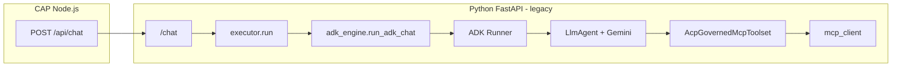

# Architecture: Agent Control Plane (SAP BTP)

> **Audience:** developers implementing this system. For product requirements and "why" reasoning, see `doc/PRD/agent-control-plane.md`. For phased delivery (tasks, exit criteria), see `doc/Action-Plan/06-architecture-aligned-e2e.md`.
> Last updated: 2026-04-24.
>
> **Reading order:** **§1.1** is a fast end-to-end map (current + target). **§2–§12** describe the **current codebase** (CAP-centric policy, fat CAP→Python payload, **legacy** Google ADK + hand-rolled loops in `python/`). **§13** is the **target architecture**: Skills, **thin JSON payload (ids only)** + **end-user JWT in `Authorization: Bearer`** (RFC 6750), Python hydration + **Python-owned chat writes**, **DeepAgent as the sole orchestrator** (Google ADK and self-managed loops **deprecated** — see **§13.4**), optional MCP pool, summarization.

---

## 1. Overview

Agent Control Plane is a governance and chat product running on SAP BTP Cloud Foundry. It consists of two SAPUI5 frontend apps (`app/admin/` for Fiori Elements governance screens, `app/chat/` for freestyle streaming chat), an `@sap/approuter` OAuth2 gateway, a CAP Node.js service (`srv/`) that exposes OData V4 endpoints for all governed entities plus custom SSE routes in `server.js`, and a separate FastAPI Python service (`python/`) that runs LLM inference and MCP tool calls. SAP HANA Cloud (HDI container) is the sole datastore. **On Cloud Foundry** and in **hybrid** local development, authentication is **XSUAA** (JWT, role collections, scopes) via **`cds bind`** — see **ADR-7** and `doc/Action-Plan/05-cap-public-python-private-production-path.md`. All components deploy as a single MTA on Cloud Foundry.

> **Target direction (see §13):** add **Skill** (procedure pack) alongside **Tool**, send **ids + `userInfo` in JSON** and **forward the user access token as `Authorization: Bearer`** to Python (not full tool/history blobs), let Python **load bodies by id** (tools, skills, session + summary) and **persist chat rows**, standardize on **DeepAgent** ([`deepagents`](https://github.com/langchain-ai/deepagents) / LangGraph) as the **only** production orchestrator (replacing **Google ADK** and hand-rolled `executor.py` loops — **deprecated**, removal per **§13.4**), and optionally split **MCP** into `services/mcp-pool/`.

### 1.1 End-to-end quick map

**One-line idea:** **CAP** decides **who may use what**; **Python** decides **how the agent runs**; **MCP servers** do the **real work**; **HANA** is the **source of truth**; **Skills** (target) are **procedure packs** on top of tools.

#### Components (what runs where)

| Component | Deploy | Role |
|---|---|---|
| **App Router** | CF app | Login, HTTPS; forwards to **CAP only** (not Python) |
| **CAP (Node)** | CF app | Fiori static + OData governance + `/api/chat` SSE hop to Python |
| **Fiori Admin UI** | Static in CAP | Agents, tools, MCP servers, groups; **Skills** when §13 lands |
| **Fiori Chat UI** | Static in CAP | Chat + SSE |
| **Python executor** | CF app / container | **Target:** DeepAgent + governed MCP client. **Legacy (deprecated):** ADK (`adk_engine.py`) + hand-rolled loops — remove after migration (**§13.4**). |
| **MCP server (tool pool)** | Same app as Python today; optional `services/mcp-pool/` later | Many tools, one HTTP surface |
| **HANA Cloud (HDI)** | Managed | Governance + chat + audit |
| **MCP gateway** (optional) | Separate CF app later | Federation when many external MCPs |

Public browser traffic only reaches **App Router → CAP**. Python and MCP are **private** to the platform network.

#### Objects (what lives where)

**Governance (HANA, via CAP OData)** — identity comes from **XSUAA JWT claims** (e.g. `dept`), not a separate login table.

| Object | Role |
|---|---|
| `Agent`, `Tool`, `McpServer`, `AgentTool` | As in `db/schema.cds` today |
| `AgentGroup`, `AgentGroupClaimValue`, `AgentGroupAgent` | JWT claim → which agents a user sees |
| `Skill`, `AgentSkill` | **Target (§13.1)** — procedure packs + mapping |

**Chat (HANA)**

| Object | Fields (short) |
|---|---|
| `ChatSession` | user, agent, title; **target:** `summary`, `summaryWatermark` (§13.6) |
| `ChatMessage` | session, role, content, timestamp |
| `ToolCallRecord` | tool name, args/result summary, duration, elevation flag |

**Runtime (Python RAM, per request — target thin path)**

| Object | Role |
|---|---|
| `RunContext` | User/session/agent ids, **allowlisted** `toolIds` / `skillIds` |
| **DeepAgent** (LangGraph harness) | **Target** orchestration for every agent turn |
| MCP client | HTTP to MCP base URLs (from hydrated `Tool` → `McpServer`) |

#### Enforcement (no short-circuit)

| Layer | Responsibility |
|---|---|
| **HANA + CDS** | Authoritative mappings: agent ↔ tool, agent ↔ group, tool status |
| **CAP** | Validates JWT, resolves allowed agents, builds allowlist (ids or, today, `effectiveTools`) |
| **Python** | Session ownership, re-fetch by id, **reject tool calls outside allowlist** (defense in depth — §13.5.2) |
| **MCP server** | Optional defense-in-depth (tenant); **not** where primary per-tool RBAC lives (§13.5.1) |

#### Flows (target: thin CAP→Python payload + Python-owned persistence)

**Admin setup**

1. Dev ships MCP server (tool handlers); DevOps deploys; Admin registers `McpServer`, **Sync Tools**, activates `Tool`.
2. **Target:** Admin authors `Skill`, links **Skill** + **Tool** on `Agent`, maps **AgentGroup** → agent for visibility.

**First user message**

1. Browser → CAP: `{ agentId, message, sessionId? }` + JWT.
2. CAP validates JWT and agent access; POST to Python with **thin JSON** (`toolIds[]`, `skillIds[]`, `sessionId`, `agentId`, `message`, `userInfo`) plus **`Authorization: Bearer <user_jwt>`** (forwarded from the browser request) and **`X-Internal-Token`** / `X-AC-*` headers (see §13.2). CAP does **not** send `effectiveTools` or `history` blobs — Python hydrates from HANA.
3. Python hydrates agent, tools, skill metadata, history/summary; runs LLM/MCP; **writes** `ChatSession` / `ChatMessage` / `ToolCallRecord` to HANA; streams SSE **through** CAP to the browser. CAP **proxies** the stream and forwards `done` (with `sessionId`, `messageId`) — **no** duplicate persistence in CAP on the target path.

**Implemented today (legacy, pre-§13 migration):** CAP still builds fat `effectiveTools` + `history` and persists chat rows on `done` in `server.js`. Refactor replaces that with the flow above.

**Next messages**

Same as above with existing `sessionId`; Python confirms session owner; **target:** load summary + messages after watermark only for the model.

**Summarization (long chats, §13.6)**

When context is too large, update `ChatSession.summary` + `summaryWatermark`; model sees summary + tail; UI still loads full history via OData.

#### Skills & MCP (concise)

- **Skill** = how to do the job (markdown procedure); **Tool** = callable action. Progressive disclosure: metadata always in context, **full body on demand** (§13.1).
- **MCP:** start with **one tool-pool service**; add **gateway/federation** only when multiple MCPs need unification (§13.5).

#### Security boundaries

- Only **App Router** is public to browsers.
- **CAP → Python:** internal URL (Python **not** internet-facing). **`X-Internal-Token`** (shared secret) proves the caller is **CAP**, not an arbitrary client. The **end-user access token** is forwarded per **[RFC 6750](https://datatracker.ietf.org/doc/html/rfc6750)** as **`Authorization: Bearer <access_token>`** — **not** duplicated in the JSON body. Python uses that Bearer token for **delegated** MCP calls where required; **`userInfo`** must stay **consistent** with the JWT subject and session ownership checks.
- **Python → MCP:** private network; use **delegated** or **machine** tokens per tool (`chat_tooling.py` / `Tool.elevated`) — follow audience-bound patterns; do **not** forward the raw browser JWT to MCP pools unless a specific integration explicitly requires it.

#### Roles & responsibilities

| Role | Owns |
|---|---|
| **Developer** | MCP tool handlers, CAP, Python executor, tests |
| **DevOps** | Deploy modules, secrets, routes, internal networking |
| **Admin (Fiori)** | Agents, tools, servers, groups — **Skills** when shipped |
| **End user** | Chat only |

#### Roadmap (one line per stage)

- **Stage 1:** App Router → CAP → Python → MCP (embedded pool today); add Skills + thin payload + summarization per §13.
- **Stage 2:** Split **`services/mcp-pool/`** when load or team boundaries require it.
- **Stage 3:** **MCP gateway** for federation + centralized OAuth only when multiple external MCPs justify the complexity.

#### Rules to remember

1. **Public = App Router only.**
2. **Target: CAP sends ids (+ `userInfo`) in JSON and Bearer in `Authorization`, not tool/history blobs** — Python hydrates from HANA.
3. **Python loads definitions by id** on the target path; tool name in MCP must match HANA `Tool.name`.
4. **Skill metadata in prompt; body on demand.**
5. **Session ownership checked every turn** on the target path.
6. **Model may only call tools in the allowlist** the executor received from CAP.
7. **Canonical detail** for implementation: **§2–§12**; **target specs: §13**.

**Folder layout:** see **§7** (actual tree) and **§7.1** (planned paths). Detailed API contracts: **§5**.

---

## 2. System Components

### 1. Admin UI (`app/admin/`)
**Technology:** Fiori Elements (SAPUI5), UI5 Tooling

**Responsibilities:**
1. List Report + Object Page for `McpServer` — register **connection** (`destinationName` and/or `baseUrl`), **test connection**, **sync tools** (discovers tool names from the MCP server), enable/disable server.
2. List Report + Object Page for `Tool` — each row is **linked to one `McpServer`**; admin reviews **Draft** tools from sync, sets **risk** / **elevated**, **activates**; **run test** calls Python. At runtime, CAP/Python resolve the **MCP base URL** from the tool’s server (**BTP Destination** or `baseUrl` on `McpServer` — same rules as `testConnection` / `syncTools` in `governance-service.js`).
3. List Report + Object Page for `Agent` — create agents; **Tool Assignments** sub-table (**`AgentTool`**) **maps this agent to governed tools** (with `permissionOverride`). This is where **which agent may call which tool** is configured; it is **not** inferred only from the JWT.
4. List Report + Object Page for `AgentGroup` — map **JWT claim** keys/values (e.g. `dept`) to **which agents** a user may **see** in chat (`GET /api/agents`).
5. All pages driven by OData V4 annotations in `app/admin/annotations/annotations.cds`; no custom controller logic for CRUD.

**End-to-end mapping (admin):** `McpServer` (where MCP lives) → **`syncTools`** creates/updates `Tool` rows pointing at that server → **`Tool.status = Active`** and **`AgentTool`** rows on **`Agent`** assign allowed tools to an agent. **Chat-time enforcement** layers **user** (JWT → agent visibility) with **agent→tool** (`AgentTool`); see **§13.5.2**.

### 2. Chat UI (`app/chat/`)
**Technology:** Freestyle SAPUI5 (no Fiori Elements)

**Responsibilities:**
1. Fetch agent list from `GET /api/agents` and render agent selector dropdown (only agents the user's groups permit).
2. Display three-panel layout: session list (left), message thread (center), input bar (bottom).
3. Open SSE connection to `POST /api/chat`; render tokens incrementally as they arrive.
4. Render collapsible tool trace (`ToolTrace.fragment.xml`) below each assistant message.
5. Load session history via `GET /odata/v4/chat/ChatSessions` and `GET /odata/v4/chat/ChatMessages`.

### 3. App Router (`approuter/`)
**Technology:** `@sap/approuter` ^21.x

**Responsibilities:**
1. Act as XSUAA OAuth2 client: redirect unauthenticated requests to XSUAA login, exchange code for JWT, store session cookie.
2. Inject `Authorization: Bearer <JWT>` into every proxied request.
3. Route `/admin*` → CAP OData + Admin UI static assets.
4. Route `/chat*` → CAP OData + Chat UI static assets.
5. Route `/api/*` → CAP `server.js` custom routes.
6. Enforce login via `xs-app.json` **`authenticationMethod`: `"route"`** (OAuth); **`xs-app.local.json`** keeps **`none`** for offline UI dev.

### 4. CAP Service (`srv/`)
**Technology:** SAP CAP (Node.js), CDS, `@sap/xssec` v4

**Responsibilities:**
1. Serve `GovernanceService` OData V4 at `/odata/v4/governance` for `McpServer`, `Tool`, `Agent`, `AgentGroup` and their compositions.
2. Serve `ChatService` OData V4 at `/odata/v4/chat` for `ChatSession`, `ChatMessage`, `ToolCallRecord`.
3. Implement bound actions: `testConnection`, `syncTools` on `McpServer`; `runTest` on `Tool`.
4. `server.js` custom route `GET /api/agents`: resolve agent list from JWT claims → group lookup in HANA.
5. `server.js` custom route `POST /api/chat`: validate JWT, resolve allow-listed **`toolIds` / `skillIds`**, POST **thin JSON** to Python and **forward `Authorization: Bearer`** (user JWT) + internal-trust headers, **proxy SSE** to the browser. **Target:** persistence of chat rows is **only in Python** (see §13.3). **Legacy:** today CAP still builds fat payload (including `userToken` in body) and persists on `done` in `server.js` until migration.
6. Enforce all role restrictions declared in CDS `@requires` and `@restrict` annotations.

### 5. Python Executor (`python/`)

**Target technology:** FastAPI, uvicorn, httpx, **[`deepagents`](https://github.com/langchain-ai/deepagents)** (LangGraph), **LangChain** chat-model wrappers for **Anthropic, OpenAI, and Google Gemini** (same providers as today), governed MCP bridge (`AcpGovernedMcpToolset` / `_AcpMcpBridgeTool`), MCP client.

**Target LLM routing:** One path — **`deepagent_engine.run_deep_agent(...)`.** Provider is selected by `LLM_PROVIDER` + `LLM_MODEL`; the model object is a LangChain `BaseChatModel` (e.g. `ChatGoogleGenerativeAI`, `ChatAnthropic`, `ChatOpenAI`). Tools and skills are injected per §13; SSE events unchanged (`token`, `tool_call`, `tool_result`, `done`, `error`, plus optional `planning`).

**Deprecated (scheduled for removal — §13.4):**

| Artifact | Role today | Status |
|----------|------------|--------|
| `python/app/adk_engine.py` | Gemini via **Google ADK** (`Runner`, `LlmAgent`) | **Deprecated** — replace with DeepAgent + `ChatGoogleGenerativeAI` |
| `google-adk` in `requirements.txt` | ADK dependency | **Deprecated** — remove after migration |
| Hand-rolled loops in `executor.py` | Anthropic / OpenAI without LangGraph | **Deprecated** — DeepAgent subsumes |

**Why deprecate ADK:** ADK is excellent for **Gemini-first** Google Cloud deployments (Agent Engine, ADK Web UI, built-in evals), but this product requires **one** orchestration harness across **all** LLM providers with **planning** and **virtual filesystem** — that is **DeepAgent on LangGraph**. Optional **`SubAgent`** delegation exists in the library but is **not** a platform foundation requirement; enterprise **Skills** (§13.1) carry governed procedures and tool guidance first. Maintaining ADK + DeepAgent + two loop styles triples operational and security review surface.

**Current codebase (legacy)** — until removed:

- **`LLM_PROVIDER=google-genai`:** Gemini runs **inside ADK** — `adk_engine.run_adk_chat`; tool execution via `mcp_client` + `AcpGovernedMcpToolset`.
- **`LLM_PROVIDER=anthropic` / `openai`:** Hand-rolled loops in `executor.py`.

**Legacy flow (Gemini / ADK — deprecated):**



**Target flow (all providers — DeepAgent):** CAP → `/chat` → `executor` → **`deepagent_engine`** → LangGraph `create_deep_agent` → governed tools → `mcp_client` (same diagram shape as §13.4 code sample).

**Responsibilities:**
1. Accept `POST /chat` from CAP `server.js`; run LLM inference (**target:** DeepAgent only; **legacy:** ADK or loops); stream SSE back.
2. Accept `POST /tool-test` from CAP `runTest` action; invoke a single MCP tool and return result.
3. Use the `effectiveTools` list provided by CAP — never decide its own tool list.
4. Call MCP servers via HTTP streamable transport; use the **forwarded Bearer token** (or derived delegated token) for delegated tools, machine service token for elevated tools (flag from hydrated `Tool` / `AgentTool`).
5. Emit structured SSE events: `token`, `tool_call`, `tool_result`, `done`, `error`.

**CAP → Python (private hop):** Python is **not** a public OAuth client. End users authenticate only to **App Router + CAP** (JWT). **CAP** is the only intended caller for **`python/`**; it forwards **user context** headers (`X-AC-User-Id`, `X-AC-Dept`, `X-AC-Roles`) and optional **`X-Internal-Token`** when **`ACP_INTERNAL_TOKEN`** is set (Python must match when configured). Identity is **vouched by CAP** on this internal hop; JWT verification is not duplicated in Python for v1.

### 6. SAP HANA Cloud
**Technology:** HDI container, managed by CAP CDS deploy

**Responsibilities:**
1. Store all governed entities: `McpServer`, `Tool`, `Agent`, `AgentTool`, `AgentGroup`, `AgentGroupClaimValue`, `AgentGroupAgent`.
2. Store all chat history: `ChatSession`, `ChatMessage`, `ToolCallRecord`.
3. Schema migrations managed by `cds deploy --to hana` via HDI.
4. Seed data in `db/data/*.csv` loaded on deploy.

---

## 3. CDS Data Model

File: `db/schema.cds`

```cds
namespace acp;
using { cuid, managed } from '@sap/cds/common';

// ─── MCP Server ──────────────────────────────────────────────────────────────

entity McpServer {
  key ID              : UUID;
  name                : String(100);
  description         : String(500);
  destinationName     : String(200);   // BTP Destination name (preferred)
  baseUrl             : String(500);   // dev-only fallback
  authType            : String enum { None; Destination; CredentialStore };
  transportType       : String enum { HTTP; stdio };
  environment         : String enum { dev; prod };
  ownerTeam           : String(100);
  status              : String(20) enum { Active; Disabled } default 'Active';
  health              : String(20) enum { OK; FAIL; UNKNOWN } default 'UNKNOWN';
  lastHealthCheck     : Timestamp;
  tools               : Composition of many Tool on tools.server = $self;
}

// ─── Tool ─────────────────────────────────────────────────────────────────────

entity Tool {
  key ID              : UUID;
  name                : String(200);   // must match MCP server tool name exactly
  description         : LargeString;  // sent to LLM as-is
  server              : Association to McpServer;
  inputSchema         : LargeString;  // JSON Schema of arguments
  outputSchema        : LargeString;  // optional
  riskLevel           : String(20) enum { Low; Medium; High } default 'Low';
  elevated            : Boolean default false;
  status              : String(20) enum { Draft; Active; Disabled } default 'Draft';
  modifiedAt          : Timestamp;
}

// ─── Agent ────────────────────────────────────────────────────────────────────

entity Agent {
  key ID              : UUID;
  name                : String(100);
  description         : String(500);
  systemPrompt        : LargeString;
  modelProfile        : String(20) enum { Fast; Quality } default 'Fast';
  identityMode        : String(20) enum { Delegated; Mixed } default 'Delegated';
  status              : String(20) enum { Draft; Active; Archived } default 'Draft';
  createdBy           : String(200);
  tools               : Composition of many AgentTool on tools.agent = $self;
}

// ─── AgentTool (join: Agent ↔ Tool) ──────────────────────────────────────────

entity AgentTool {
  key ID                : UUID;
  agent                 : Association to Agent;
  tool                  : Association to Tool;
  permissionOverride    : String(30) enum { Inherit; ForceDelegated; ForceElevated } default 'Inherit';
}

// ─── AgentGroup ───────────────────────────────────────────────────────────────

entity AgentGroup {
  key ID              : UUID;
  name                : String(100);
  description         : String(500);
  claimKey            : String(100);   // JWT attribute name e.g. "dept"
  status              : String(20) enum { Active; Disabled } default 'Active';
  claimValues         : Composition of many AgentGroupClaimValue on claimValues.group = $self;
  agents              : Composition of many AgentGroupAgent on agents.group = $self;
}

// ─── AgentGroupClaimValue (one row per matching value) ───────────────────────

entity AgentGroupClaimValue {
  key ID              : UUID;
  group               : Association to AgentGroup;
  value               : String(200);   // e.g. "procurement"
}

// ─── AgentGroupAgent (join: AgentGroup ↔ Agent) ──────────────────────────────

entity AgentGroupAgent {
  key ID              : UUID;
  group               : Association to AgentGroup;
  agent               : Association to Agent;
}

// ─── ChatSession ──────────────────────────────────────────────────────────────

entity ChatSession {
  key ID              : UUID;
  agentId             : UUID;
  userId              : String(200);
  title               : String(200);
  createdAt           : Timestamp;
  updatedAt           : Timestamp;
  messages            : Composition of many ChatMessage on messages.session = $self;
}

// ─── ChatMessage ──────────────────────────────────────────────────────────────

entity ChatMessage {
  key ID              : UUID;
  session             : Association to ChatSession;
  role                : String(20) enum { user; assistant };
  content             : LargeString;
  timestamp           : Timestamp;
  toolCalls           : Composition of many ToolCallRecord on toolCalls.message = $self;
}

// ─── ToolCallRecord ───────────────────────────────────────────────────────────

entity ToolCallRecord {
  key ID              : UUID;
  message             : Association to ChatMessage;
  toolName            : String(200);
  arguments           : LargeString;   // JSON
  resultSummary       : LargeString;
  durationMs          : Integer;
  elevatedUsed        : Boolean default false;
  timestamp           : Timestamp;
}
```

---

## 4. CAP Service Definitions

### GovernanceService (`srv/governance-service.cds`)

```cds
using acp from '../db/schema';

service GovernanceService @(path: '/odata/v4/governance') {

  // ── McpServer ────────────────────────────────────────────────────────────
  @(restrict: [
    { grant: ['READ'],              to: ['Agent.Author', 'Agent.Admin', 'Agent.Audit'] },
    { grant: ['WRITE', 'CREATE', 'UPDATE', 'DELETE'], to: ['Agent.Admin'] }
  ])
  entity McpServers as projection on acp.McpServer actions {
    action testConnection()                     returns String;  // pings server, updates health + lastHealthCheck
    action syncTools()                          returns String;  // discovers tools, creates Draft Tool records
  };

  // ── Tool ─────────────────────────────────────────────────────────────────
  @(restrict: [
    { grant: ['READ'],              to: ['Agent.Author', 'Agent.Admin', 'Agent.Audit'] },
    { grant: ['WRITE', 'CREATE', 'UPDATE', 'DELETE'], to: ['Agent.Admin'] }
  ])
  entity Tools as projection on acp.Tool actions {
    @(requires: 'Agent.Admin')
    action runTest(args: LargeString)           returns LargeString;  // calls Python /tool-test
  };

  // ── Agent ─────────────────────────────────────────────────────────────────
  @(restrict: [
    { grant: ['READ'],              to: ['Agent.Author', 'Agent.Admin', 'Agent.Audit'] },
    { grant: ['WRITE', 'CREATE', 'UPDATE', 'DELETE'], to: ['Agent.Author', 'Agent.Admin'] }
  ])
  entity Agents as projection on acp.Agent;

  entity AgentTools as projection on acp.AgentTool;

  // ── AgentGroup ───────────────────────────────────────────────────────────
  @(restrict: [
    { grant: ['READ'],              to: ['Agent.Admin', 'Agent.Audit'] },
    { grant: ['WRITE', 'CREATE', 'UPDATE', 'DELETE'], to: ['Agent.Admin'] }
  ])
  entity AgentGroups as projection on acp.AgentGroup;

  entity AgentGroupClaimValues as projection on acp.AgentGroupClaimValue;
  entity AgentGroupAgents       as projection on acp.AgentGroupAgent;
}
```

**Handler responsibilities (`srv/governance-service.js`):**
- `testConnection`: resolves the server's base URL (via `@sap-cloud-sdk/connectivity` `getDestination()` if `destinationName` is set, else uses `baseUrl`); calls `GET <resolvedBaseUrl>/health`; treats HTTP 200 as `OK`, any error as `FAIL`; writes result to `health` and `lastHealthCheck`.
- `syncTools`: calls `POST <resolvedBaseUrl>/mcp/tools/list` on the MCP server; upserts `Tool` records with `status = 'Draft'`. Duplicate tool names for the same server are updated, not inserted.
- `runTest`: requires `Agent.Admin` scope; calls `POST <python_url>/tool-test` with the tool's MCP server URL, name, and caller-supplied `args`; returns raw result string.
- Elevated flag write guard: a `before UPDATE Tools` handler rejects changes to the `elevated` field unless the requester holds `Agent.Admin`.

---

### ChatService (`srv/chat-service.cds`)

```cds
using acp from '../db/schema';

service ChatService @(path: '/odata/v4/chat') {

  // Agent.User sees only their own sessions; Agent.Audit sees all.
  @(restrict: [
    { grant: ['READ'],   to: ['Agent.User'],  where: 'userId = $user' },
    { grant: ['READ'],   to: ['Agent.Audit'] },
    { grant: ['CREATE'], to: ['Agent.User'] },
    { grant: ['UPDATE'], to: ['Agent.User'],  where: 'userId = $user' }
  ])
  entity ChatSessions as projection on acp.ChatSession;

  @(restrict: [
    { grant: ['READ'],   to: ['Agent.User', 'Agent.Audit'] },
    { grant: ['CREATE'], to: ['Agent.User'] }
  ])
  entity ChatMessages as projection on acp.ChatMessage;

  // ToolCallRecord rows are created by server.js only; no direct client writes.
  @(restrict: [
    { grant: ['READ'],   to: ['Agent.User', 'Agent.Audit'] }
  ])
  entity ToolCallRecords as projection on acp.ToolCallRecord;
}
```

**Handler notes (`srv/chat-service.js`):**
- `ChatSession` reads are automatically filtered to `userId = req.user.id` for `Agent.User` via the `@restrict` `where` clause.
- `ChatMessage` creates from the client create a message row; the server also creates rows programmatically from `server.js` on SSE completion.
- `ToolCallRecord` has no `CREATE` grant for any client scope — only `server.js` inserts these rows via `cds.run(INSERT.into(...))`.

---

### server.js custom routes (`srv/server.js`)

Runs in the same CAP Node process. Registered via `cds.on('bootstrap', app => { ... })`.

**`GET /api/agents`**

1. Validate JWT via `@sap/xssec` `createSecurityContext`.
2. Require `Agent.User` scope; return 403 otherwise.
3. Read JWT claims from `SecurityContext` (e.g. `token.payload.dept`).
4. Query HANA:
   ```sql
   SELECT DISTINCT a.ID, a.name, a.description, a.modelProfile
   FROM acp_AgentGroupAgent aga
   JOIN acp_AgentGroup g ON aga.group_ID = g.ID
   JOIN acp_AgentGroupClaimValue v ON v.group_ID = g.ID
   JOIN acp_Agent a ON aga.agent_ID = a.ID
   WHERE v.value = <claim_value>
     AND g.claimKey = <claim_key>
     AND g.status = 'Active'
     AND a.status = 'Active'
   ```
5. Return JSON array (see Section 5).

**`POST /api/chat`**

1. Validate JWT; require `Agent.User`; return 403 otherwise.
2. Parse body: `{ agentId, message, sessionId }`.
3. Verify user's groups include this agent (same query as above); return 403 if not.
4. Load agent config from HANA: `Agent` row + `AgentTool` rows with joined `Tool` rows (status `Active` only).
5. Apply `permissionOverride` logic per `AgentTool`:
   - `Inherit` → use tool's own `elevated` flag and agent's `identityMode`.
   - `ForceDelegated` → always delegated regardless of `elevated`.
   - `ForceElevated` → only allowed if agent `identityMode = 'Mixed'` AND tool `elevated = true`; otherwise reject.
6. **Legacy:** load conversation history from HANA and pass `history` in the Python payload. **Target (§13.2):** do not load history in CAP; send `toolIds`, `skillIds`, `sessionId`, `agentId`, `message`, `userInfo` in JSON only.
7. **Target:** forward the browser’s **`Authorization: Bearer <jwt>`** header to Python unchanged (or rebuild it from the validated token). **Legacy:** also embed token in body as `userToken` — remove when migrating to §13.2. Extract `userId` and `email` from `SecurityContext` for `userInfo`.
8. Set `Content-Type: text/event-stream`; POST to Python `/chat` — **legacy:** `{ agentConfig, effectiveTools, message, history, userInfo, userToken }`; **target:** thin JSON per §13.2 + **`Authorization: Bearer`** + internal-trust headers (**no** `userToken` in body).
9. Pipe Python SSE stream to browser.
10. **Legacy:** on completion, CAP may persist `ChatMessage` / `ToolCallRecord` / `ChatSession` (current `server.js`). **Target:** Python persists all chat rows; CAP only forwards SSE including final `done` with `sessionId`, `messageId`.

---

## 5. API Contracts

### OData V4 endpoints (auto-generated by CAP)

| Method | URL | Notes |
|--------|-----|-------|
| `GET` | `/odata/v4/governance/McpServers` | List all; requires Author/Admin/Audit |
| `POST` | `/odata/v4/governance/McpServers` | Create; requires Admin |
| `PATCH` | `/odata/v4/governance/McpServers(ID)` | Update; requires Admin |
| `DELETE` | `/odata/v4/governance/McpServers(ID)` | Delete; requires Admin |
| `POST` | `/odata/v4/governance/McpServers(ID)/acp.testConnection` | Ping + update health |
| `POST` | `/odata/v4/governance/McpServers(ID)/acp.syncTools` | Discover + create Draft tools |
| `GET` | `/odata/v4/governance/Tools` | List all; requires Author/Admin/Audit |
| `POST` | `/odata/v4/governance/Tools(ID)/acp.runTest` | Admin only; invoke tool via Python |
| `GET` | `/odata/v4/governance/Agents` | List all; requires Author/Admin/Audit |
| `POST` | `/odata/v4/governance/Agents` | Create; requires Author/Admin |
| `GET` | `/odata/v4/governance/AgentGroups` | List all; requires Admin/Audit |
| `POST` | `/odata/v4/governance/AgentGroups` | Create; requires Admin |
| `GET` | `/odata/v4/chat/ChatSessions` | Filtered to own sessions for User; all for Audit |
| `GET` | `/odata/v4/chat/ChatMessages` | Filtered via association to session |

---

### REST/SSE endpoints (`server.js`)

#### `GET /api/agents`

**Response:**
```json
{
  "agents": [
    {
      "id": "3fa85f64-5717-4562-b3fc-2c963f66afa6",
      "name": "Invoice Analyst",
      "description": "Answers questions about open invoices and POs.",
      "modelProfile": "Fast"
    }
  ]
}
```

---

#### `POST /api/chat`

**Request body:**
```json
{
  "agentId": "3fa85f64-5717-4562-b3fc-2c963f66afa6",
  "message": "What are my open invoices?",
  "sessionId": "uuid-or-null"
}
```

**Response:** `Content-Type: text/event-stream`
```
data: {"type":"token","content":"Here are "}
data: {"type":"token","content":"your open invoices:"}
data: {"type":"tool_call","toolName":"query_invoices","args":{"status":"open"}}
data: {"type":"tool_result","toolName":"query_invoices","summary":"Found 3 invoices","durationMs":342}
data: {"type":"token","content":"I found 3 open invoices..."}
data: {"type":"done","sessionId":"uuid","messageId":"uuid"}
```

**Error event:**
```
data: {"type":"error","message":"Agent not accessible for this user"}
```

---

### Python service endpoints (internal — called by CAP `server.js` only)

#### `POST /chat`

**Target request (§13.2):** thin JSON body (ids + `userInfo` only) — Python hydrates the rest. **HTTP headers:** `Authorization: Bearer <access_token>` (end-user JWT forwarded from CAP), `X-Internal-Token` (and `X-AC-*` per `srv/python-trust.js`). **Do not** put the access token in the JSON body.

**Legacy request (current `server.js`):** fat JSON including `userToken` in body (migrate to header-only Bearer per §13.2).

```json
{
  "agentConfig": {
    "systemPrompt": "You are an invoice analyst. Answer only questions about invoices and POs.",
    "modelProfile": "Fast",
    "identityMode": "Delegated"
  },
  "effectiveTools": [
    {
      "name": "query_invoices",
      "description": "Queries open invoices from S/4HANA. Returns a list of invoice objects.",
      "inputSchema": { "type": "object", "properties": { "status": { "type": "string" } } },
      "mcpServerUrl": "https://mcp-server.cfapps.eu10.hana.ondemand.com",
      "elevated": false
    }
  ],
  "message": "What are my open invoices?",
  "history": [
    { "role": "user", "content": "Hello" },
    { "role": "assistant", "content": "Hi! How can I help you?" }
  ],
  "userInfo": {
    "userId": "john.doe@example.com",
    "email": "john.doe@example.com",
    "groups": ["Procurement Group"]
  },
  "userToken": "eyJhbGciOiJSUzI1NiJ9..."
}
```

**Response:** SSE stream (same format as `POST /api/chat` above).

---

#### `POST /tool-test`

Admin-only. Called by CAP `runTest` action.

**Request:**
```json
{
  "mcpServerUrl": "https://mcp-server.cfapps.eu10.hana.ondemand.com",
  "toolName": "query_invoices",
  "args": { "status": "open" }
}
```

**Response:**
```json
{
  "result": "[{\"id\":\"INV-001\",\"amount\":1234.50,\"status\":\"open\"}]"
}
```

---

## 6. Auth Flow

### Mermaid Sequence Diagram

```mermaid
sequenceDiagram
    participant Browser
    participant AppRouter as App Router
    participant XSUAA
    participant CAP as CAP server.js
    participant Python as Python Executor
    participant MCP as MCP Server

    %% ── First visit ────────────────────────────────────────────────────────
    Browser->>AppRouter: GET /chat (no session)
    AppRouter->>XSUAA: Redirect → /authorize (OAuth2 PKCE)
    XSUAA->>Browser: Login page
    Browser->>XSUAA: Credentials
    XSUAA->>AppRouter: Authorization code callback
    AppRouter->>XSUAA: Exchange code → JWT + refresh_token
    AppRouter->>Browser: Session cookie + serve index.html

    %% ── Chat request ───────────────────────────────────────────────────────
    Browser->>AppRouter: POST /api/chat {agentId, message, sessionId}
    AppRouter->>AppRouter: Inject Authorization: Bearer <JWT>
    AppRouter->>CAP: POST /api/chat + JWT

    CAP->>CAP: createSecurityContext(authService, {req})
    CAP->>CAP: checkLocalScope("Agent.User") → 403 if false
    CAP->>CAP: Read JWT claims (dept, role, etc.)
    CAP->>CAP: Query HANA: resolve AgentGroups → verify agent access
    CAP->>CAP: Resolve allow-list → toolIds/skillIds (+ legacy: effectiveTools + history)
    CAP->>CAP: Set Content-Type: text/event-stream

    CAP->>Python: POST /chat thin JSON + Authorization: Bearer + X-Internal-Token
    Python->>Python: Hydrate from HANA; LLM + tools
    Python->>MCP: tools/call + delegated or machine token per tool
    MCP-->>Python: Tool result
    Python-->>CAP: SSE (token, tool_call, tool_result, …)
    CAP-->>AppRouter: SSE piped through
    AppRouter-->>Browser: Streaming tokens rendered

    Python->>Python: On completion: INSERT ChatMessage + ToolCallRecords + ChatSession
```

### Agent Group Resolution (plain text)

1. CAP reads the validated `SecurityContext` from the request.
2. Extracts all JWT claim key/value pairs from `token.payload` (e.g. `dept: "procurement"`, `costCenter: "SCM"`).
3. For each claim pair, queries HANA:
   ```sql
   SELECT DISTINCT aga.agent_ID
   FROM   acp_AgentGroupClaimValue v
   JOIN   acp_AgentGroup g      ON v.group_ID  = g.ID
   JOIN   acp_AgentGroupAgent aga ON aga.group_ID = g.ID
   WHERE  v.value    = '<claim_value>'
     AND  g.claimKey = '<claim_key>'
     AND  g.status   = 'Active'
   ```
4. Unions results across all claim pairs to get the full set of agent IDs the user may access.
5. For `POST /api/chat`: confirms the requested `agentId` is in that set; returns 403 otherwise.
6. Loads `AgentTool` rows for the agent where `Tool.status = 'Active'`.
7. Applies `permissionOverride` per `AgentTool` row to determine effective `elevated` flag per tool.
8. Constructs the `effectiveTools` array forwarded to Python — Python receives only this list and cannot add to it.

---

## 7. Repository Folder Structure

> Reflects the **actual** tree as of 2026-04-18. Generated artifacts (`gen/`, `node_modules/`, `python/venv/`) and local-only files (`.env`, `.cdsrc-private.json`) are included for completeness but gitignored.

```
fiori-agent-platform/
├── app/
│   ├── admin/                              # Fiori Elements admin app
│   │   ├── annotations.cds                 # Root annotations entry (LR/OP for McpServer, Tool, Agent, AgentGroup)
│   │   ├── annotations/
│   │   │   └── annotations.cds             # Split/legacy annotations file (kept in sync with the root one)
│   │   ├── webapp/
│   │   │   ├── Component.js                # UI5 component bootstrap
│   │   │   ├── Component-preload.js        # Build output; regenerated on ui5 build
│   │   │   ├── manifest.json               # App descriptor (OData service binding, routes)
│   │   │   ├── index.html                  # Bootstrap entry point
│   │   │   └── i18n/
│   │   │       ├── i18n.properties
│   │   │       ├── i18n_en.properties
│   │   │       └── i18n_en_US.properties
│   │   ├── package.json                    # ui5 tooling devDependencies
│   │   └── ui5.yaml
│   └── chat/                               # Freestyle SAPUI5 chat app
│       ├── webapp/
│       │   ├── controller/
│       │   │   ├── App.controller.js
│       │   │   └── Chat.controller.js      # Send, SSE stream, session load/save
│       │   ├── view/
│       │   │   ├── App.view.xml
│       │   │   └── Chat.view.xml           # Three-panel: session list, thread, input bar
│       │   ├── fragment/
│       │   │   └── ToolTrace.fragment.xml
│       │   ├── css/
│       │   │   └── style.css
│       │   ├── i18n/
│       │   │   ├── i18n.properties
│       │   │   ├── i18n_en.properties
│       │   │   └── i18n_en_US.properties
│       │   ├── vendor/
│       │   │   ├── marked.min.js           # Markdown → HTML renderer for assistant messages
│       │   │   └── purify.min.js           # DOMPurify sanitizer (XSS guard before innerHTML)
│       │   ├── Component.js
│       │   ├── Component-preload.js
│       │   ├── manifest.json
│       │   └── index.html
│       ├── package.json
│       └── ui5.yaml
│
├── srv/                                    # CAP service layer
│   ├── governance-service.cds              # OData V4: McpServer, Tool, Agent, AgentGroup
│   ├── governance-service.js               # Handlers: testConnection, syncTools, runTest; role guards
│   ├── chat-service.cds                    # OData V4: ChatSession, ChatMessage, ToolCallRecord
│   ├── chat-service.js                     # Handlers: user-scoped session reads, message writes
│   ├── python-trust.js                     # Internal-token + X-AC-* header injector for CAP → Python
│   └── server.js                           # Custom HTTP: GET /api/agents, POST /api/chat (SSE)
│
├── db/
│   ├── schema.cds                          # Platform entity definitions (namespace acp)
│   ├── demo-schema.cds                     # ERP demo entity definitions (namespace acp.demo)
│   └── data/                               # CSV seed rows loaded on cds deploy
│       ├── acp-McpServer.csv
│       ├── acp-Tool.csv
│       ├── acp-Agent.csv
│       ├── acp-AgentTool.csv
│       ├── acp-AgentGroup.csv
│       ├── acp-AgentGroupClaimValue.csv
│       ├── acp-AgentGroupAgent.csv
│       ├── acp.demo-Vendor.csv
│       ├── acp.demo-PurchaseOrder.csv
│       ├── acp.demo-POItem.csv
│       ├── acp.demo-InvoiceHeader.csv
│       └── acp.demo-InvoiceItem.csv
│
├── python/                                 # Python AI executor + (today) embedded MCP server
│   ├── app/
│   │   ├── __init__.py
│   │   ├── main.py                         # FastAPI app; mounts /chat, /tool-test, and /mcp routers
│   │   ├── executor.py                     # Entry: routes to deepagent_engine (target); legacy loops until removed (§13.4)
│   │   ├── adk_engine.py                   # DEPRECATED — Google ADK for Gemini; remove after DeepAgent+Gemini parity (§13.4)
│   │   ├── chat_tooling.py                 # Shared MCP auth helper (delegated vs machine token)
│   │   ├── mcp_server.py                   # FastAPI router: POST /mcp/tools/list, POST /mcp/tools/call  (→ §13.5 extract)
│   │   ├── mcp_client.py                   # MCP HTTP client; dispatches tool calls to MCP servers
│   │   ├── db.py                           # HANA connection (hdbcli)
│   │   ├── config.py                       # Env vars: LLM_PROVIDER, LLM_API_KEY, GOOGLE_API_KEY, LLM_MODEL
│   │   └── tools/
│   │       ├── __init__.py
│   │       ├── procurement.py
│   │       ├── finance.py
│   │       └── registry.py                 # Dict: tool name → handler function + JSON Schema
│   ├── venv/                               # Local virtualenv (gitignored; see python-venv-policy rule)
│   ├── requirements.txt                    # fastapi, uvicorn, httpx, deepagents, langchain-*; google-adk deprecated (§13.4)
│   ├── Procfile                            # web: uvicorn app.main:app --host 0.0.0.0 --port $PORT
│   └── manifest.yml                        # CF push manifest for Python app
│
├── approuter/                              # @sap/approuter gateway
│   ├── xs-app.json                         # Route table: /admin→CAP, /chat→CAP, /api→CAP server.js
│   ├── xs-app.local.json                   # Local dev variant with authenticationMethod:"none"
│   ├── default-env.json                    # Local dev: mock VCAP_SERVICES for XSUAA + Destination
│   └── package.json                        # { "dependencies": { "@sap/approuter": "^21.x" } }
│
├── scripts/                                # Operator tooling (PowerShell + helpers)
│   ├── btp-platform.ps1                    # btp CLI orchestration (subaccount, role collections, users)
│   ├── btp-auth-api.ps1                    # XSUAA/apiaccess REST calls (role collections, apps)
│   ├── ias-scim.ps1                        # IAS SCIM user + custom-attribute management
│   └── xsuaa-role-attrs-dept-idp.json      # Example payload for manually created IdP-mapped role
│
├── gen/                                    # cds build output (gitignored; produced by `npx cds build --production`)
│   └── db/                                 # HDI artifacts consumed by acp-db-deployer module
│
├── xs-security.json                        # XSUAA descriptor: scopes, attributes, role-templates (no role-collections)
├── mta.yaml                                # MTA build + deploy descriptor (all modules + resources)
├── package.json                            # Root: workspaces, cds dependency, shared scripts, cds.requires profiles
├── package-lock.json
├── .cdsrc.json                             # CAP overrides (optional)
├── .cdsrc-private.json                     # Local-only cds.requires overrides (gitignored)
├── .env                                    # Local-only runtime env (gitignored)
├── .env.example                            # Local dev env var template
├── .gitignore
├── README.md
└── doc/
    ├── Architecture/
    │   └── fiori-agent-platform.md         # THIS FILE: §1.1 quick map + §2–§12 current + §13 target deltas
    ├── Action-Plan/                        # Execution plans (hybrid setup, public/private split, etc.)
    ├── PRD/
    │   └── agent-control-plane.md
    ├── SeedData/                           # Notes and fixtures for CSV seed generation
    └── .manifest.json                      # Doc artifact registry
```

### 7.1 Planned additions (target state, see §13)

The following paths **do not exist yet**; they are the concrete destinations for the §13 deltas and are listed here so the file layout target is unambiguous.

```
python/app/
├── deepagent_engine.py     # §13.4  LangGraph deepagents harness (create_deep_agent + virtual FS; SubAgent optional / Skill-driven)
├── hydrator.py             # §13.3  HANA read-only loader (agent, tool defs, skill meta, session + summary watermark)
├── session_store.py        # §13.3  Session ownership + message append helpers (refactor from executor)
├── langfuse_callbacks.py   # §13.4.1  optional: Langfuse CallbackHandler wiring for DeepAgent invoke (LANGFUSE_* env)
└── skills/                 # §13.1  Optional local cache for skill bodies fetched by id (progressive disclosure)

services/
└── mcp-pool/               # §13.5  Extract of python/app/mcp_server.py + tools/ into its own CF module
    ├── app/
    │   ├── main.py         #         POST /mcp/tools/list, POST /mcp/tools/call
    │   ├── registry.py
    │   └── tools/          #         procurement.py, finance.py, ...
    ├── requirements.txt
    └── manifest.yml

db/
└── schema.cds              # §13.1, §13.6  adds Skill, AgentSkill, ChatSession.summary, ChatSession.summaryWatermark (optional transient Agent.engine — prefer omit; §13.4)
```

---

## 8. BTP Services

| Service | Plan | Role in this system | Bound to |
|---------|------|---------------------|----------|
| Authorization & Trust Management (XSUAA) | `application` | JWT issuer, OAuth2 AS, scope and role definitions | `acp-approuter`, `acp-cap` |
| SAP HANA Cloud | `hdi-shared` | Primary database via HDI container; all entities + chat history | `acp-cap` |
| Destination Service | `lite` | Stores MCP server URLs + credentials; read by CAP `governance-service.js` for tool calls | `acp-cap` |
| Cloud Foundry Runtime | — | Runs `acp-approuter`, `acp-cap`, `acp-python` as CF apps | — |
| HTML5 Application Repository | `app-host` | (Optional) hosts built UI5 bundles; CAP can also serve static files directly in dev | `acp-approuter` |
| SAP Build Work Zone | `standard` | (Later) Fiori Launchpad tile for Work Zone integration | — |

---

## 9. Local Development Setup

### Topology

```
Browser
  └── localhost:5001  (approuter — default-env.json mocks VCAP_SERVICES)
        ├── /admin  →  ui5 serve app/admin   (localhost:3001)
        ├── /chat   →  ui5 serve app/chat    (localhost:3002)
        └── /api    →  cds watch srv/        (localhost:4004)
                          └── POST /chat  →  uvicorn python/app/main:app  (localhost:8000)
```

### Start commands

```bash
# Terminal 1 — CAP (requires `cf login` + `cds bind db --to <hana>` first; see Action Plan 04)
npm run watch

# Terminal 2 — Admin UI
cd app/admin && ui5 serve --port 3001

# Terminal 3 — Chat UI
cd app/chat && ui5 serve --port 3002

# Terminal 4 — App Router
cd approuter && npm start

# Terminal 5 — Python
cd python && uvicorn app.main:app --reload --port 8000
```

### Local dev database + auth (Spectrum 1)

**Hybrid and development profiles:** **`auth.kind = "xsuaa"`** — use **`cds bind`** to XSUAA + HANA, **`npm run watch`**, and the **App Router** for login (JWT to CAP). The Fiori apps use same-origin **`fetch`** with **`credentials: "include"`** through the App Router (no Basic auth).

**HANA** stores governance and chat data only. It has **no** separate “login table” for end users beyond what your app persists. Seeds define **`AgentGroup` / `AgentGroupClaimValue` / `AgentGroupAgent`** (claim key **`dept`**, values like `it`, `procurement`, `finance`). **`server.js`** resolves allowed agents by matching **`user.attr.dept`** (and related JWT attributes) to those rows—the **same idea** as production, where **`dept`** comes from a JWT claim (IAS → XSUAA). Demo CSVs may mention emails (e.g. `bob@acme.com` on a PO line) as **business data**, not as the auth identity store.

**SOP (local / hybrid HANA):** (1) **`cf login`**, **`cds bind db --to <HDI instance>`**, **`npm run deploy:hana`**, **`npm run watch`** — use the **`server listening on` URL** from the console (avoid a stale process on another port). (2) Fill **`.env`** **`HANA_*`** for Python if you use SQL tools. (3) To test **different agent visibility**, sign in as users whose JWT carries different **`dept`** (or mapped) values per your IAS/XSUAA setup. (4) **Production path:** XSUAA + IAS + BTP role collections; map **`dept`** into the token as in Action Plan 02.

Further checklist: **`doc/Action-Plan/04-hybrid-hana-spectrum-1.md`**, CAP auth overview: [Authentication | capire](https://cap.cloud.sap/docs/node.js/authentication).

Python SQL tools need **`.env`** **`HANA_*`** copied from the **same** HDI service key (schema = runtime user schema).

### `approuter/default-env.json` (minimal shape)

```json
{
  "VCAP_SERVICES": {
    "xsuaa": [{
      "name": "acp-xsuaa",
      "credentials": {
        "clientid": "sb-agent-control-plane!t1",
        "clientsecret": "...",
        "url": "https://<subdomain>.authentication.eu10.hana.ondemand.com",
        "uaadomain": "authentication.eu10.hana.ondemand.com",
        "verificationkey": "-----BEGIN PUBLIC KEY-----\n..."
      }
    }]
  }
}
```

---

## 10. MTA Deployment

### `mta.yaml` key structure

```yaml
_schema-version: "3.1"
ID: agent-control-plane
version: 1.0.0

modules:

  - name: acp-approuter
    type: approuter.nodejs
    path: approuter/
    requires:
      - name: acp-xsuaa
      - name: acp-html5-host
    properties:
      TENANT_HOST_PATTERN: "^(.*)-${default-domain}"

  - name: acp-cap
    type: nodejs
    path: .
    build-parameters:
      build-result: gen/
      builder: custom
      commands:
        - npx cds build --production
    requires:
      - name: acp-xsuaa
        auth-type: xsuaa
      - name: acp-hana
      - name: acp-destination
    provides:
      - name: acp-cap-api
        properties:
          url: ${default-url}

  - name: acp-python
    type: python
    path: python/
    requires:
      - name: acp-xsuaa
      - name: acp-hana          # Required: Python SQL tools query HANA directly via hdbcli
    properties:
      LLM_PROVIDER: google-genai           # Change to anthropic or openai as needed
      LLM_MODEL: gemini-3.1-flash-lite-preview          # Model name for the chosen provider
      # LLM_API_KEY / GOOGLE_API_KEY must be injected via: cf set-env acp-python <KEY> <VALUE>

  - name: acp-db-deployer
    type: hdb
    path: gen/db
    requires:
      - name: acp-hana

resources:

  - name: acp-xsuaa
    type: org.cloudfoundry.managed-service
    parameters:
      service: xsuaa
      service-plan: application
      path: ./xs-security.json

  - name: acp-hana
    type: org.cloudfoundry.managed-service
    parameters:
      service: hana
      service-plan: hdi-shared

  - name: acp-destination
    type: org.cloudfoundry.managed-service
    parameters:
      service: destination
      service-plan: lite

  - name: acp-html5-host
    type: org.cloudfoundry.managed-service
    parameters:
      service: html5-apps-repo
      service-plan: app-host
```

### Deploy commands

```bash
# Build MTA archive
mbt build

# Deploy to Cloud Foundry
cf deploy mta_archives/agent-control-plane_*.mtar

# Monitor
cf mta agent-control-plane
cf logs acp-cap --recent
```

---

## 11. xs-security.json (canonical)

Canonical copy: repo root **`xs-security.json`**.

### 11.1 What the file contains (and what it must not)

The descriptor defines **`xsappname`**, **scopes**, **`attributes`** (e.g. **`dept`**), **`role-templates`** (with **`attribute-references`** where needed), and **`oauth2-configuration`**.

**Do not add a `role-collections` section** to this file for normal operation. If **`role-collections`** are defined here and you run **`cf update-service … -c xs-security.json`** (or MTA deploy), XSUAA **creates** those collections and **application-managed** roles in the subaccount. Those roles are often **read-only** in **BTP Cockpit → Security → Roles**: the **`dept`** attribute stays **Unrestricted** and you **cannot** set **Source = Identity Provider** for IAS → **`xs.user.attributes.dept`**. Managed roles also **cannot** be removed with **`btp delete security/role`** (*read-only Role*).

**Correct approach (full SOP):** keep **`role-collections`** out of **`xs-security.json`**. Then, in order: (1) **IAS** — Self-defined attribute **`dept`** sourced from **`${customAttribute1}`** (or Identity Directory → Application Custom Attribute 1) so tokens carry **`xs.user.attributes.dept`**. (2) **XSUAA** — `cf update-service` / MTA with this file (templates only). (3) **BTP** — **Create Role** on each **`Agent*ACP`** template (or **`btp create security/role`** with IdP **`dept`** mapping; example payload **`scripts/xsuaa-role-attrs-dept-idp.json`**). (4) **Role collections** — Cockpit or **`btp create security/role-collection`** + **`btp add security/role`**, pointing only at those **manual** roles. (5) **Trust Configuration** → custom IAS → **Attribute Mappings** to assign collections by **`dept`** value (optional automation). (6) **Users** — shadow users from IAS login and/or **`btp assign security/role-collection`**. See **`.cursor/rules/xsuaa-manual-roles.mdc`** and **README** (BTP security).

Attribute **`dept`** in the JWT comes from **IAS** emitting **`dept`** (mapped from **`customAttribute1`**) plus **BTP** roles that reference **Identity Provider** **`dept`** — see **Action Plan 02**.

### 11.2 Embedded copy (may drift; trust repo file `xs-security.json`)

Role templates use an **`ACP`** suffix (**`AgentUserACP`**, **`AgentAuthorACP`**, **`AgentAdminACP`**, **`AgentAuditACP`**) so subaccount roles created from them stay distinct from legacy XSUAA-managed names. **No `role-collections` block.**

```json
{
  "xsappname": "agent-control-plane",
  "description": "Role-templates use an ACP suffix (AgentUserACP, …) so subaccount roles built from them are clearly separate from legacy managed names. Do not add role-collections here — create collections in BTP.",
  "tenant-mode": "dedicated",
  "scopes": [
    { "name": "$XSAPPNAME.Agent.User", "description": "Open chat; use agents assigned to user's groups." },
    { "name": "$XSAPPNAME.Agent.Author", "description": "Create and edit agents within policy." },
    { "name": "$XSAPPNAME.Agent.Admin", "description": "Manage MCP servers, tools, groups, policies, elevated flags." },
    { "name": "$XSAPPNAME.Agent.Audit", "description": "Read-only access to all records, sessions, and tool-call logs." }
  ],
  "attributes": [
    {
      "name": "dept",
      "description": "Department code for agent resolution. Mapped from IAS customAttribute1 via BTP role attribute mapping.",
      "valueType": "string",
      "valueRequired": "false"
    }
  ],
  "role-templates": [
    {
      "name": "AgentUserACP",
      "description": "Standard chat user (ACP-suffixed template for editable subaccount roles).",
      "scope-references": ["$XSAPPNAME.Agent.User"],
      "attribute-references": ["dept"]
    },
    {
      "name": "AgentAuthorACP",
      "description": "Agent designer (ACP).",
      "scope-references": ["$XSAPPNAME.Agent.User", "$XSAPPNAME.Agent.Author"],
      "attribute-references": ["dept"]
    },
    {
      "name": "AgentAdminACP",
      "description": "Platform administrator (ACP).",
      "scope-references": ["$XSAPPNAME.Agent.User", "$XSAPPNAME.Agent.Author", "$XSAPPNAME.Agent.Admin"],
      "attribute-references": ["dept"]
    },
    {
      "name": "AgentAuditACP",
      "description": "Read-only auditor (ACP).",
      "scope-references": ["$XSAPPNAME.Agent.Audit"]
    }
  ],
  "oauth2-configuration": {
    "grant-types": ["authorization_code", "client_credentials", "refresh_token"],
    "autoapprove": true,
    "redirect-uris": ["http://localhost:5000/login/callback"]
  }
}
```

---

## 12. Architecture Decision Records

### ADR-1: CAP + server.js over standalone Express BFF

**Decision:** All server-side logic lives in a single CAP Node.js process. Custom SSE routes are registered in `srv/server.js` via `cds.on('bootstrap', ...)`.

**Rationale:** CAP provides OData V4, HANA HDI binding, CDS annotations, and `@sap/xssec` integration with no boilerplate. Adding `server.js` custom routes in the same process avoids a second CF app, second service binding, and second deployment unit. The `cds watch` development loop still works for both OData and SSE routes.

---

### ADR-2: Two SAPUI5 apps (admin + chat) over a single app

**Decision:** `app/admin/` is a Fiori Elements app; `app/chat/` is a freestyle SAPUI5 app. They are separate UI5 projects with separate `manifest.json` and `ui5.yaml`.

**Rationale:** Fiori Elements apps require `@ui5/webcomponents-fiori` and CDS annotation-driven metadata; freestyle apps require custom XML views and controllers. Mixing them in one project creates conflicting build configurations and annotation scopes. Separate projects allow independent versioning and deployment.

---

### ADR-3: SAP HANA Cloud over PostgreSQL

**Decision:** HANA Cloud via CAP HDI container is the sole database. No PostgreSQL.

**Rationale:** A single BTP-native database eliminates a second infrastructure dependency. CAP's `cds deploy --to hana` handles schema migration via HDI. The CAP ORM (CQL) abstracts SQL dialects, so entity definitions are database-agnostic by design.

---

### ADR-4: XSUAA over SAP Cloud Identity Services (IAS) for v1

**Decision:** XSUAA is used for JWT issuance, scope definitions, and role templates (**`Agent*ACP`** in **`xs-security.json`**). **Role collections and concrete roles** are created in the **BTP subaccount** (Cockpit or **`btp`** CLI), **not** via a **`role-collections`** block in **`xs-security.json`**, so **Identity Provider** attribute mapping (e.g. **`dept`**) remains editable for manually created roles.

**Rationale:** XSUAA has the most mature CAP integration (`cds.env.requires.auth.kind = "xsuaa"`) and the `@sap/xssec` v4 library validates XSUAA tokens with a single `createSecurityContext` call. The same `@sap/xssec` v4 library supports IAS tokens with the same API, so migrating later requires only a service binding swap. Roles defined only as **role templates** in **`xs-security.json`** avoid application-managed read-only roles that block IdP mapping for **`xs.user.attributes`**.

---

### ADR-5: SSE over WebSocket for token streaming

**Decision:** `POST /api/chat` returns `Content-Type: text/event-stream`. No WebSocket upgrade.

**Rationale:** SSE is a standard HTTP response and proxies transparently through `@sap/approuter` without any special configuration. WebSocket requires an `Upgrade` negotiation that App Router must explicitly support. Chat output is unidirectional (server → browser), so SSE is sufficient.

---

### ADR-6: Agent group resolution in CAP, not Python

**Decision:** CAP `server.js` is the sole component that resolves which agents and tools a user may access. Python receives a fully computed `effectiveTools` list and cannot add to or override it.

**Rationale:** Python is an AI executor, not a policy engine. Allowing Python to *decide* its own tool list would make the governance model unenforceable — a compromised Python process could call any registered tool. CAP is the trust boundary: it holds the XSUAA binding and the role-enforcement annotations. All **policy decisions** happen in CAP before the request reaches Python.

**Target refinement (see §13):** CAP still owns the *decision* (which agent / which tool-ids / which skill-ids are allowed for this user). In the **thin-payload** target, CAP sends **only the allowed ids**, and Python **reads HANA read-only** to hydrate tool metadata, skill bodies, and session+summary. Python must **never** expand the id set it received; it only materializes what CAP already authorized. The trust boundary stays in CAP.

---

### ADR-7: Spectrum 1 — XSUAA + live HANA (local hybrid)

**Decision:** **`cds.requires.auth["[hybrid]"]`** and **`["[development]"]`** use **`xsuaa`** with **`cds bind`** to a real XSUAA instance (see Action Plan **05**). **`cds.requires.db["[hybrid]"].kind = "hana"`** is bound to **SAP HANA Cloud** (HDI).

**Rationale:** CAP **`cds bind`** lets local hybrid match **production JWT and roles** before CF deploy. The database and seeds are **production-shaped**. Historical Spectrum 1 notes live in **`doc/Action-Plan/04-hybrid-hana-spectrum-1.md`**.

**Operational note:** Open the **App Router** URL (same-origin **`/api`** + session cookie; forwarded Bearer token to CAP). See README and §9 **SOP**.

---

## 13. Target Architecture Deltas (end-to-end plan)

This section lists the **planned deltas** between the current implementation (Sections 1–12) and the **target** summarized in **§1.1**. Each delta is a discrete increment; they are independent and can land in any order.

### 13.1 Skills (new first-class entity)

A **Skill** is a short procedure pack (markdown body + JSON metadata) that teaches an agent *how* to use a tool or handle a repeating workflow. Skills complement MCP tools (which are *capabilities*); a skill is *procedure*.

Planned CDS additions (`db/schema.cds`):

```cds
entity Skill {
  key ID         : UUID;
  name           : String(100);
  description    : String(500);   // metadata sent to LLM for progressive disclosure
  body           : LargeString;   // full markdown procedure, loaded only when agent selects it
  status         : String(20) enum { Draft; Active; Disabled } default 'Draft';
  modifiedAt     : Timestamp;
}

entity AgentSkill {
  key ID         : UUID;
  agent          : Association to Agent;
  skill          : Association to Skill;
}
```

Admin UI: new List Report + Object Page for `Skill`; Agent Object Page gains a `Skills` facet (same pattern as `AgentTool`).

**Progressive disclosure:** the agent prompt receives only `{name, description}` for every assigned skill. The full `body` is fetched by Python on demand (when the agent decides to use that skill), keeping the context window small.

**Skills vs sub-agents (enterprise alignment):** Industry patterns distinguish **Skills** (reusable procedures, domain playbooks — *what to do and how*) from **sub-agents** (separate orchestrated workers with isolated context — *who delegates to whom*); see e.g. [Microsoft AI agent design patterns](https://learn.microsoft.com/en-us/azure/architecture/ai-ml/guide/ai-agent-design-patterns) (orchestrator–worker, handoff) and practitioner literature on modular agent systems. This product standardizes on **governed Skills in HANA** as the primary way to encode enterprise procedure alongside **Tool** allowlists. **`deepagents.SubAgent` is not part of the v1 foundation** — the runtime uses `create_deep_agent(..., subagents=[])` unless a future, **Skill-driven** design explicitly maps a Skill to a delegated worker (optional; §13.4). Do **not** ship a hardcoded default such as `tool-researcher` in core.

### 13.2 Thin CAP → Python payload (ids in JSON + Bearer in header)

**No feature flag:** the product standard is this single contract (migrate code from the legacy fat payload in `server.js`).

CAP still runs the full authorization pipeline (JWT → agent resolution → `AgentTool` / `AgentSkill` filter by status) and produces **`toolIds` / `skillIds`**. It does **not** ship tool schemas, skill bodies, or chat history over the wire.

**End-user access token (required):** forward the same token the browser sent to CAP using the **`Authorization: Bearer <access_token>`** header ([RFC 6750](https://datatracker.ietf.org/doc/html/rfc6750)). Python reads the Bearer token from the request for **identity** (aligned with `userInfo` / JWT claims) and **delegated MCP** tool calls where `Tool.elevated` is false. **Do not** duplicate the token in the JSON body.

**Internal hop (separate concern):** `X-Internal-Token` (+ optional `X-AC-*` headers from `srv/python-trust.js`) proves the request **originates from CAP** on the private URL — orthogonal to the user Bearer token; it only blocks non-CAP callers.

**HTTP request to Python (CAP → Python):**

| Header | Purpose |
|--------|---------|
| `Authorization` | `Bearer <end-user access_token>` — forwarded from browser → CAP |
| `X-Internal-Token` | Shared secret — proves caller is CAP |
| `X-AC-*` | Optional user context mirrors (Plan **05**) |

**JSON body (thin):**

```json
{
  "sessionId": "uuid-or-null",
  "agentId": "uuid",
  "toolIds": ["uuid", "..."],
  "skillIds": ["uuid", "..."],
  "message": "new user message",
  "userInfo": { "userId": "...", "dept": "...", "roles": ["..."] }
}
```

### 13.3 Python loads by id; Python owns chat persistence

Python `/chat` handler steps (replaces the fat-payload + CAP-side persistence path):

1. Verify **`X-Internal-Token`** matches `ACP_INTERNAL_TOKEN` — only **CAP** may call Python on the private URL.
2. Require **`Authorization: Bearer`**; parse the access token; align **`userInfo`** and session rows with the JWT subject (ownership).
3. Verify session ownership: `ChatSession(sessionId).userId == userInfo.userId` (or create new session when `sessionId` is null).
4. Hydrate from HANA (read-only for governance data):
   - `Agent` row (system prompt, model profile, identity mode).
   - `Tool` rows for `toolIds` (re-check `status = 'Active'`; any inactive id → reject).
   - `Skill` metadata for `skillIds` (name + description only; body loaded lazily).
   - Session history **from the latest summary watermark onward** (see §13.6).
5. Build **DeepAgent** graph state; **stream SSE to CAP** (token, tool_call, tool_result, …).
6. **Persist chat rows in HANA from Python** when the turn completes: `ChatSession`, `ChatMessage` (user + assistant), `ToolCallRecord`; emit **`done`** with `sessionId`, `messageId`. **CAP** proxies the stream and **does not** duplicate these inserts on the target path.

Python's DB role is **read-only** for governance entities + **append-only** for chat tables. Governance writes (CRUD on `McpServer` / `Tool` / `Skill` / `Agent` / `AgentGroup`) remain CAP-only.

### 13.4 DeepAgent as the sole orchestrator; deprecation of Google ADK and hand-rolled loops

**Decision:** Production chat uses **only** the [`deepagents`](https://github.com/langchain-ai/deepagents) harness on **LangGraph**. **Google ADK** (`adk_engine.py`, `google-adk` package) and **hand-rolled** tool loops in `executor.py` are **deprecated** and **scheduled for removal** after agents are migrated and tests pass on DeepAgent + LangChain chat models for each provider (Gemini via `langchain-google-genai`, not ADK).

**Rationale:** One orchestration surface for **all** LLM providers; planning (`write_todos`) and virtual filesystem without a Gemini-only fork. **Sub-agents** are an optional DeepAgents feature — **not** required for the enterprise baseline (**Skills** + tools). Reduces security review scope and avoids maintaining three execution paths.

**Schema note:** If an `Agent.engine` column was introduced for multi-engine experiments, **target state** is a single value **`DeepAgent`** only — or drop the column once legacy code is deleted.

**Removal checklist (engineering):**

1. Implement `deepagent_engine.py` + provider-specific LangChain models (including Gemini).
2. Route **all** `/chat` traffic through DeepAgent; parity tests vs legacy ADK/loop golden transcripts.
3. Delete `adk_engine.py`, remove `google-adk` from `requirements.txt`, strip dead branches from `executor.py`.
4. Update Admin UI / seeds so no agent references ADK or Loop.

#### 13.4.1 Observability: Langfuse (open source) vs ADK Web

**What ADK Web gives you (legacy Google-centric dev loop):** visual **trace** of runs, drill-down into tool calls, **evaluation** with evalsets / JSON session tests — see [Evaluating Agents with ADK](https://codelabs.developers.google.com/adk-eval/instructions). That UI is **not** replicated inside `deepagents`.

**Chosen stack for this product — [Langfuse](https://langfuse.com/) (MIT license):**

| Capability | ADK (legacy path) | This product (DeepAgent) |
|------------|-------------------|---------------------------|
| Trace UI (steps, tools, planning, optional sub-agents, latency, tokens) | ADK Web | **[Langfuse](https://langfuse.com/docs/observability/overview)** — project dashboard, drill-down spans; integrate via **`langfuse.langchain.CallbackHandler`** on `agent.invoke(..., config={"callbacks": [langfuse_handler]})` ([DeepAgents + Langfuse](https://langfuse.com/integrations/frameworks/langchain-deepagents)) |
| Self-host / data sovereignty | N/A (Google-centric) | **[Self-hosted Langfuse](https://langfuse.com/self-hosting)** (Docker/K8s) — traces and prompts stay on your infrastructure; optional [Langfuse Cloud](https://cloud.langfuse.com) for dev |
| Eval / regression | ADK `AgentEvaluator`, evalsets | Langfuse **datasets**, **scores**, experiments, LLM-as-judge ([docs](https://langfuse.com/docs/evaluation/overview)); export production traces into eval sets |
| Optional graph debugging | — | **[LangGraph Studio](https://langchain-ai.github.io/langgraph/)** (local) for graph replay — orthogonal to Langfuse |

**Environment (Python):** `LANGFUSE_PUBLIC_KEY`, `LANGFUSE_SECRET_KEY`, `LANGFUSE_HOST` (point `LANGFUSE_HOST` at self-hosted URL or regional cloud). Never commit keys; use CF user-provided service or Credential Store in prod.

**Not used:** **LangSmith** — proprietary SaaS; this architecture standardizes on **Langfuse** for OSS alignment and self-hosting. **Arize Phoenix** (Apache 2.0) remains a valid alternative if teams standardize on it instead.

**Migration note:** For **Gemini-only** experiments during cutover, teams may still run **ADK Web** against a **throwaway ADK agent outside this repo** — not wired to CAP — until DeepAgent + Langfuse parity is proven.

**Actual `deepagents` API (v0.5, April 2026) — foundation (no default `SubAgent`):**

```python
# python/app/deepagent_engine.py
from deepagents import create_deep_agent  # SubAgent optional — see §13.1 Skills vs sub-agents

def build_agent(model, mcp_tools, agent_cfg, skill_metadata):
    system_prompt = render_prompt(agent_cfg.systemPrompt, skill_metadata)  # §13.1 progressive disclosure
    return create_deep_agent(
        model=model,
        tools=mcp_tools,            # AcpGovernedMcpToolset-bridged MCP tools
        system_prompt=system_prompt,
        subagents=[],               # enterprise procedures live in Skills + tools, not hardcoded sub-agents
    )
```

**Optional later:** `SubAgent(...)` / `AsyncSubAgent` only if **governed** via **Skill** metadata and tool allowlists (same trust model as CAP `toolIds`), not as a built-in `tool-researcher`.

What we get for free from the harness:

- `write_todos` planning tool — decomposes long-horizon tasks, visible to the UI as a structured todo panel.
- Virtual filesystem tools (`read_file`, `write_file`, `edit_file`, `ls`, `glob`, `grep`) — used to **offload large tool responses** (e.g. full PO dumps, CSV exports) out of the LLM context window and reference them by filename in later turns.
- **`SubAgent` / `AsyncSubAgent` (optional)** — isolated context for delegated workers; **not** part of the v1 product foundation — use **Skills** for procedure + tool patterns first.

**Integration rules:**

1. The `tools=` argument receives the **governed MCP bridge** (`AcpGovernedMcpToolset` / `_AcpMcpBridgeTool`). DeepAgent never gets a tool the executor didn't authorize.
2. `system_prompt` includes skill **metadata only** (§13.1). Skill bodies are fetched by id via a dedicated `load_skill(skill_id)` tool (added to `tools=`), implementing progressive disclosure.
3. The virtual filesystem is **per-request, in-memory** — not persisted across chat turns in v1. Persisting selected "artifacts" to HANA is a later increment.
4. DeepAgent's LangGraph stream events (`on_tool_start`, `on_tool_end`, `on_chat_model_stream`) are mapped to the same SSE event shapes the chat UI already expects (`token`, `tool_call`, `tool_result`, `done`).

### 13.5 MCP Pool as a separate microservice (optional)

Current (§7): MCP router is embedded in `python/app/mcp_server.py` (same CF app as the executor).

Target: extract to `services/mcp-pool/` as an independent CF module:

```
services/
└── mcp-pool/
    ├── app/
    │   ├── main.py          # FastAPI: POST /mcp/tools/list, POST /mcp/tools/call
    │   ├── registry.py      # dynamic tool registry (all tools live here)
    │   └── tools/           # procurement.py, finance.py, ...
    ├── requirements.txt
    └── manifest.yml
```

Python executor then speaks to `mcp-pool` over HTTP (same transport as any external MCP server). Benefits: independent scaling, separate deploy cadence, clean "tool host" vs "agent host" split. Not required for v1.

#### 13.5.1 MCP governance & tool-level authorization

Research note (industry state, April 2026): the MCP specification mandates **OAuth 2.1 with PKCE** for remote (HTTP/SSE) servers and treats each MCP server as an **OAuth Resource Server** that delegates trust to an external IdP via **Protected Resource Metadata (PRM)**. However, the **core spec does not define per-tool authorization** — OAuth scopes authorize access to the MCP server as a whole, not to individual tools. Enterprises close that gap with an **MCP-aware gateway** (Bifrost / Teleport / Kong AI Gateway / custom) that intercepts `tools/call` and enforces RBAC, audit, and token-audience checks before forwarding to the pool. ([MCP auth spec](https://modelcontextprotocol.io/docs/tutorials/security/authorization), [Teleport: enterprise MCP](https://goteleport.com/blog/complicating-mcp-enterprise/), [WorkOS: MCP 2026 roadmap](https://workos.com/blog/2026-mcp-roadmap-enterprise-readiness))

**How this system maps to those patterns:**

| Industry role                  | In this architecture                                                                 |
|--------------------------------|--------------------------------------------------------------------------------------|
| IdP                            | **IAS → XSUAA** (JWT to the user; `dept` claim for agent visibility)                 |
| OAuth Resource Server (MCP)    | `services/mcp-pool/` (target) or embedded `python/app/mcp_server.py` (today)         |
| MCP governance gateway         | **CAP `server.js`** — decides `toolIds` per user/agent before Python is ever invoked |
| Per-tool RBAC enforcement      | **HANA `AgentTool` join + `Tool.status = 'Active'`**, re-verified by Python on hydrate |
| Tool-call audit trail          | **`ToolCallRecord` rows written by Python** when the turn completes (target); legacy path may still insert from CAP until migration |

**Rules we adopt from the research:**

1. **Never rely on in-server tool authz.** The MCP pool treats any authenticated caller as allowed to call any tool it exposes. The allow-list is CAP-decided (`toolIds`) + Python-re-checked on hydrate. A compromised MCP pool cannot escalate a user's tool set because the executor only *asks for* the tools CAP already approved.
2. **Audience-bound tokens (no passthrough).** When Python calls `mcp-pool` (or any external MCP) it presents a token whose `aud` is the specific MCP resource. The end-user JWT is **never** forwarded unchanged to the MCP pool; the executor mints/uses a delegated or machine token scoped to that audience (current behavior in `chat_tooling.py` — keep it).
3. **Central audit in the app tier.** Every tool call is logged as **`ToolCallRecord`** in HANA (written by **Python** on the target path; CAP still **authorizes** `toolIds` before invocation). Individual MCP servers do not need their own audit pipeline.
4. **Extensions, not spec forks.** Per-tool scopes, virtual keys, and elevation flags live in **our governance schema** (`Tool.elevated`, `AgentTool.permissionOverride`), not as bespoke MCP-protocol additions. This keeps the MCP pool swappable for a hosted gateway later without schema changes.
5. **Optional future: MCP gateway microservice.** If the tool fleet grows beyond a single `mcp-pool`, insert a thin `services/mcp-gateway/` in front of N pool instances. Its only jobs: token-audience check, CAP allow-list re-verification (defense in depth), audit mirror. CAP remains the source of truth; the gateway is a data-plane enforcement point.

#### 13.5.2 Tool-level RBAC: user (JWT) + agent (`AgentTool`) — CAP and Python

Per-tool access is **not** “JWT alone” and **not** “MCP server OAuth alone.” It is the intersection of **(A)** which **agents** the **user** may use and **(B)** which **tools** that **agent** may use.

| Layer | Mechanism | Enforced in |
|-------|-----------|-------------|
| **User → agent** | JWT claims (e.g. `dept`) matched via **`AgentGroup` / `AgentGroupClaimValue` / `AgentGroupAgent`** to a set of **agent IDs** the user may chat with | **CAP** (`GET /api/agents`, `POST /api/chat` agent check) |
| **Agent → tool** | **`AgentTool`** join: only tools **assigned** to this agent; `permissionOverride` + `Tool.elevated` + `Agent.identityMode` yield effective delegation vs elevated MCP token | **CAP** (when building `toolIds` / `effectiveTools`) |
| **Tool → MCP URL** | Each **`Tool`** associates to **`McpServer`**; resolved **`mcpServerUrl`** (destination or `baseUrl`) is passed to Python **only after** the tool is in the allowlist | **CAP** (resolve URL in handler); **Python** (hydrate from HANA by id on thin path) |
| **Defense in depth** | Even if the LLM names a tool, execution **must not** run unless `tool_name ∈ allowlist` built from CAP-authorized `toolIds` | **Python** (`RunContext.allowed_tool_names`, assert before `mcp_client.call_tool`) |

**Summary:** **JWT** does not list tools directly; it constrains **which agents** appear for the user. **Tool-level RBAC** for chat is **`AgentTool`** (plus `Tool.status = Active`) for the **selected `agentId`**. CAP computes **`toolIds`** for each `/api/chat` request; Python **re-hydrates** and **re-checks** before every MCP call (§13.3, Phase **5–6** in `doc/Action-Plan/06-architecture-aligned-e2e.md`).

### 13.6 Chat summarization (context-window safety)

Planned `ChatSession` additions:

```cds
entity ChatSession {
  // ... existing fields ...
  summary              : LargeString;    // rolling summary up to summaryWatermark
  summaryWatermark     : Timestamp;      // messages older than this are already summarized
}
```

Python history loader: pass `{ summary, messages where timestamp > summaryWatermark }` to the LLM. A background summarization job (or inline trigger when recent-window token count crosses a threshold) updates `summary` + `summaryWatermark`. The UI still renders the full message list (unchanged) from `ChatMessage` rows; only the LLM context is trimmed.

### 13.7 New/updated ADRs (target)

- **ADR-8 (planned): Thin id-only JSON body + user JWT in `Authorization: Bearer`.** Reason: smaller wire format, single source of truth in DB, Python hydrates per-request; **RFC 6750** transport for the access token; **`X-Internal-Token`** only proves CAP origin. **No** long-lived env feature flag — one contract after migration.
- **ADR-9 (planned): Skills as first-class, stored in HANA, loaded by id.** Reason: procedural guidance separate from capability (tool), progressive disclosure via metadata.
- **ADR-10 (planned): Summary + watermark on `ChatSession`.** Reason: bounded LLM context regardless of user-visible history length.
- **ADR-11 (target): DeepAgent-only orchestrator; deprecate Google ADK and hand-rolled executor loops.** Reason: one multi-provider harness (planning, filesystem); **Skills** for enterprise procedures; optional **`SubAgent`** only if Skill-governed; remove `adk_engine.py` and `google-adk` after migration; Gemini via LangChain `ChatGoogleGenerativeAI` inside DeepAgent.
- **ADR-12 (planned): CAP is the MCP governance gateway; tool-level RBAC lives in HANA, not in MCP servers.** Reason: MCP core spec authorizes *servers*, not *tools*; per-tool authz must be enforced by an external layer. CAP already owns identity + allow-list + audit — making it the gateway avoids a second policy store. Audience-bound tokens (no JWT passthrough to MCP) are mandatory.
- **ADR-13 (optional ops): Langfuse for trace + eval parity with ADK Web.** Reason: DeepAgent has no built-in “ADK Web”; **Langfuse** is MIT-licensed, self-hostable, and integrates with DeepAgents via LangChain callbacks ([Langfuse + DeepAgents](https://langfuse.com/integrations/frameworks/langchain-deepagents)). LangSmith is **not** adopted (proprietary).

### 13.8 Migration order (suggested)

1. **§13.6** summary fields (schema-only, no behavior change).
2. **§13.1** Skill + AgentSkill entities + Admin UI (governance-only, no chat impact).
3. **§13.2 + §13.3** flip payload to thin JSON + **Bearer forwarded**, move hydration and **chat persistence** into Python (replace CAP `done` inserts).
4. **§13.4** DeepAgent-only engine; remove ADK + legacy loops after parity tests.
5. **§13.5** extract `services/mcp-pool/` when tool count or load justifies it.
